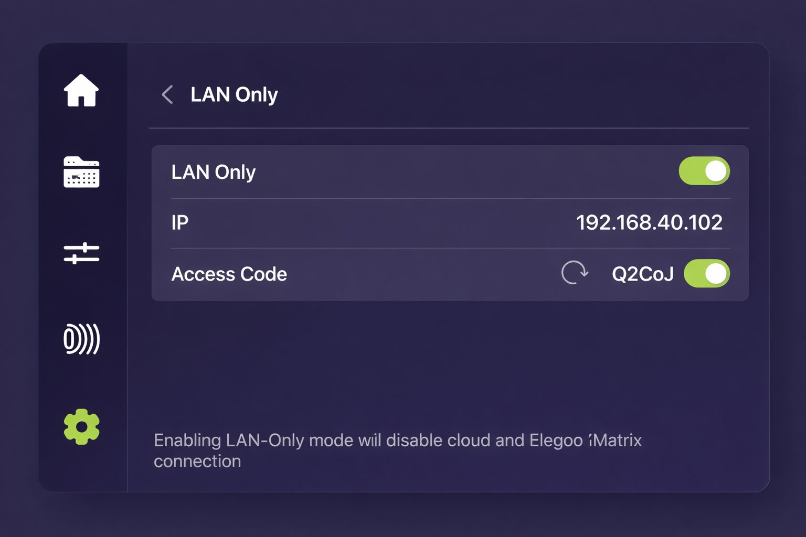

# Elegoo Centauri Carbon 2: switch to LAN mode

Tiger Studio's direct link needs **LAN Only mode** enabled on the printer itself — a one-time,
on-screen setup. See [Elegoo compatibility](../compatibility/elegoo.md) for the rest of the
integration.

On the touch screen, select Settings → LAN Only. Enable LAN Only + Access Code and select Confirm.

---

**◀ Previous:** [Elegoo compatibility](../compatibility/elegoo.md) · **▲ [Documentation index](../../README.md)**
