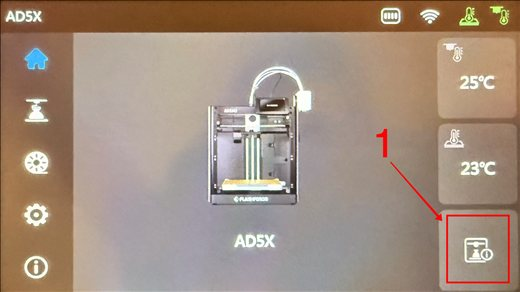
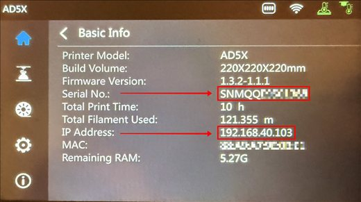
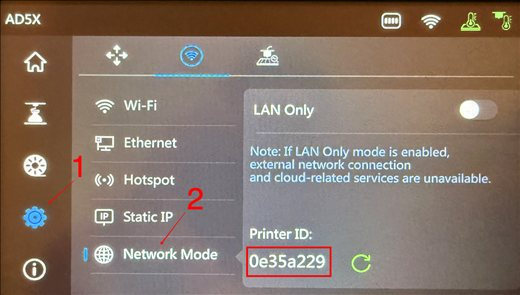

# FlashForge: connection tutorial

FlashForge printers have no cloud option — Tiger Studio always connects over the local network. If
automatic discovery doesn't find your printer, add it by IP instead: look up its serial number, IP
address and printer ID on the touchscreen first. See
[FlashForge compatibility](../compatibility/flashforge.md) for the rest of the integration.

<strong>Step 1.</strong> On the main interface, tap the "Basic Info" button at the bottom right of the screen.

<strong>Step 2.</strong> In the Basic Info page, retrieve the Serial No. and the IP Address.

<strong>Step 3.</strong> Select the gear icon, tap "Network Mode", then retrieve the Printer ID.

---

**◀ Previous:** [FlashForge compatibility](../compatibility/flashforge.md) · **▲ [Documentation index](../../README.md)**
