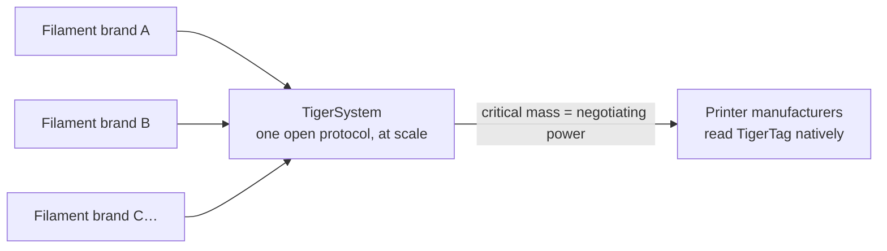

# For filament manufacturers

## The smart spool is happening — the only open way to do it is here

Printers increasingly expect intelligent filament: AMS-class systems, per-slot
material detection, automatic settings. Every printer maker answers with a
**closed tag, locked to their machines, feeding their cloud** — zero
interoperability, zero value for your brand outside their walls.

**TigerTag is, today, the only viable open smart-spool solution shipping at
scale**: an open, standard, agnostic, cross-platform protocol — with more than
**2 million chips already produced** and integrated at the factory by brands
like Rosa3D, eSun, Sunlu, Landu, Jamg He and R3D.

## Factory integration: days, not months

We have the experience and the technology to get TigerTag chips into your
production line **quickly, easily, and at very low cost — in just a few
days**:

- Standard NTAG hardware (no proprietary components, no tooling lock-in).
- A proven integration playbook already deployed in multiple factories.
- The shared reference database gives your products a precise, universal
  identity every compatible app resolves identically.

Brands shipping TigerTags in their products can carry the **TigerTag
Certified** mark — a visible signal to customers that the spool is smart and
open.

> Reach out through the
> **[GitHub organization](https://github.com/TigerTag-Project)** to start the
> conversation.

## Already on the shelves

| | | |
|---|---|---|
|  |  |  |

*Rosa3D, eSun, Sunlu — real boxes, shipping with TigerTag inside.*

## What your customers get on day one

A spool that identifies itself to **any NFC phone**, a full inventory
ecosystem (mobile, desktop, web), live integration with six printer brands,
weight tracking, sharing — an experience **far beyond what any closed
single-vendor environment offers**, and it works with every printer your
customers own, not just one brand's.

## The collective play

Every filament brand that joins TigerSystem strengthens all the others:

Alone, no filament brand can convince printer manufacturers to read its tags.
**Together, behind one open protocol, we can.** The more brands ship
TigerTag, the stronger the case for native, firmware-level TigerTag support
in the printers themselves — and every participant benefits from that
leverage.

---

**▲ [Documentation index](../../README.md)** · **Related:** [Why TigerSystem exists](./why-tigersystem.md), [Compatibility](../compatibility/README.md), [FAQ — Manufacturers](../faq/README.md)
