# For filament manufacturers

> **Make your spools smart and connected.**

## The smart spool is happening — the only open way to do it is here

Printers increasingly expect intelligent filament: AMS-class systems, per-slot
material detection, automatic settings. Every printer maker answers with a
**closed tag, locked to their machines, feeding their cloud** — zero
interoperability, zero value for your brand outside their walls. And every
locked tag serves a second purpose: **steering your customers toward the
printer maker's own filament.** TigerTag was created in 2023 precisely so
third-party brands would have a better answer — spools smarter than the
proprietary ones, without the walled garden.

**TigerTag is the most deployed third-party RFID protocol in the world** —
and, today, the only viable open smart-spool solution shipping at scale: an
open, standard, agnostic, cross-platform protocol with more than
**2.5 million chips already produced** and integrated at the factory by brands
like Rosa3D, eSun, Sunlu, Landu, Jamg He, R3D, Filforme and Nanovia.

## Factory integration: days, not months

We have the experience and the technology to get TigerTag chips into your
production line **quickly, easily, and at very low cost — up and running in
as little as 5 days**, writing **each chip in about 1 second** (thousands of
spools a day, one click):

- Standard NTAG hardware (no proprietary components, no tooling lock-in),
  sourced at a scale and cost chosen for one non-negotiable goal: **add the
  technology without adding one cent to the spool's end-user price.**
- A proven integration playbook already deployed in multiple factories,
  powered by the [TigerTag Factory & Manager](../products/factory-suite.md)
  industrial suite: your filament database on one side, line-speed mass
  writing into every spool on the other — with the **factory signature
  proving each product's origin**.
- The shared reference database gives your products a precise, universal
  identity every compatible app resolves identically.

Brands shipping TigerTags in their products can carry the **TigerTag
Certified** mark — a visible signal to customers that the spool is smart and
open.

> Reach out through the
> **[GitHub organization](https://github.com/TigerTag-Project)** to start the
> conversation.

## They announced it themselves

Public posts on the brands' own channels — not our press release
(sources & full announcements:
[tigersystem.io/en/manufacturers](https://tigersystem.io/en/manufacturers)).
**Click any image to open the original post:**

| | | |
|---|---|---|
| <a href="https://www.instagram.com/p/DVyeOZajZSm/">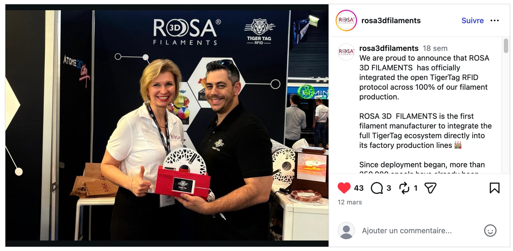</a> | <a href="https://www.instagram.com/reel/DVoAMqTk5ck/">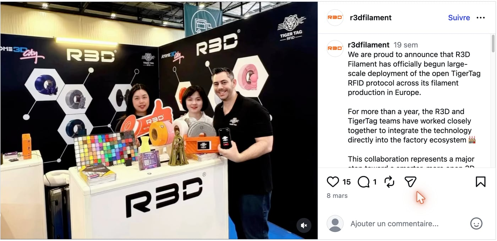</a> | <a href="https://www.instagram.com/p/DUjydNXkc1W/">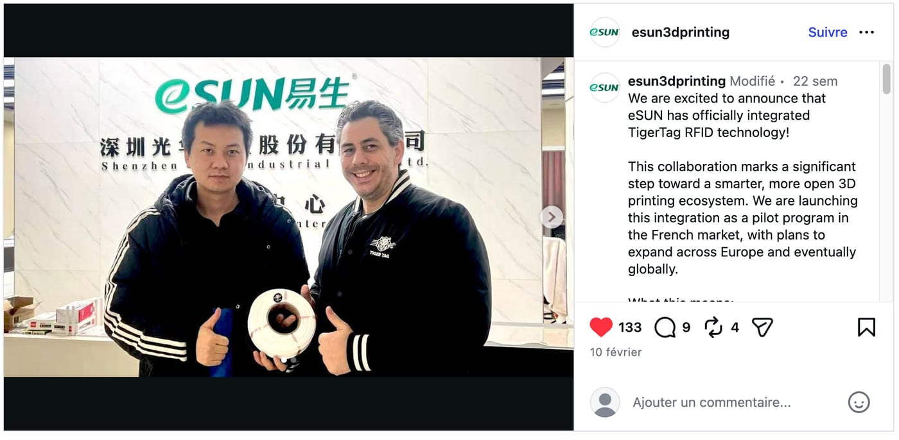</a> |

> **ROSA 3D FILAMENTS** — *"officially integrated the open TigerTag RFID
> protocol across 100 % of our filament production."* More than 250 000
> spools already produced with TigerTag.
> ([original post](https://www.instagram.com/p/DVyeOZajZSm/))

> **R3D Filament** — *"officially begun large-scale deployment of the open
> TigerTag RFID protocol across its filament production in Europe."*
> ([original post](https://www.instagram.com/reel/DVoAMqTk5ck/))

> **eSUN** — *"officially integrated TigerTag RFID technology!"* — piloting
> in the French market, expanding across Europe.
> ([original post](https://www.instagram.com/p/DUjydNXkc1W/))

## Already on the shelves

| | | |
|---|---|---|
| 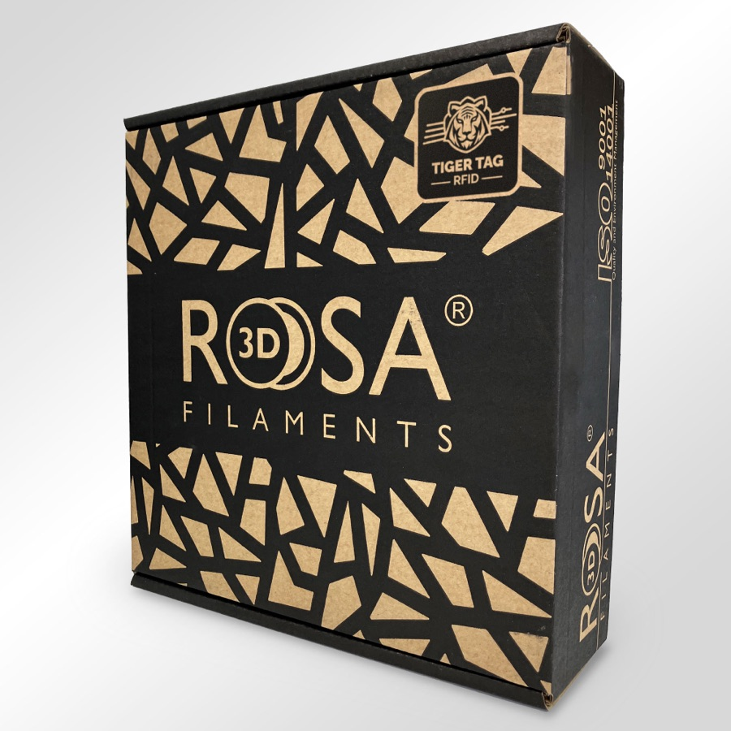 | 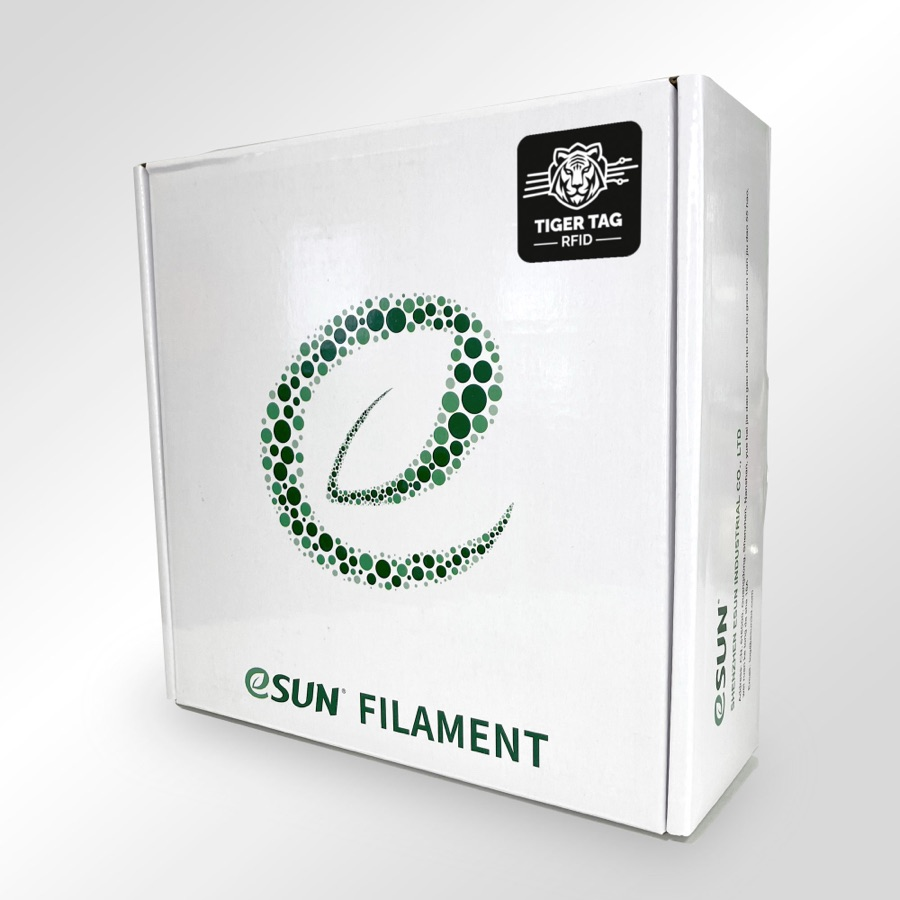 | 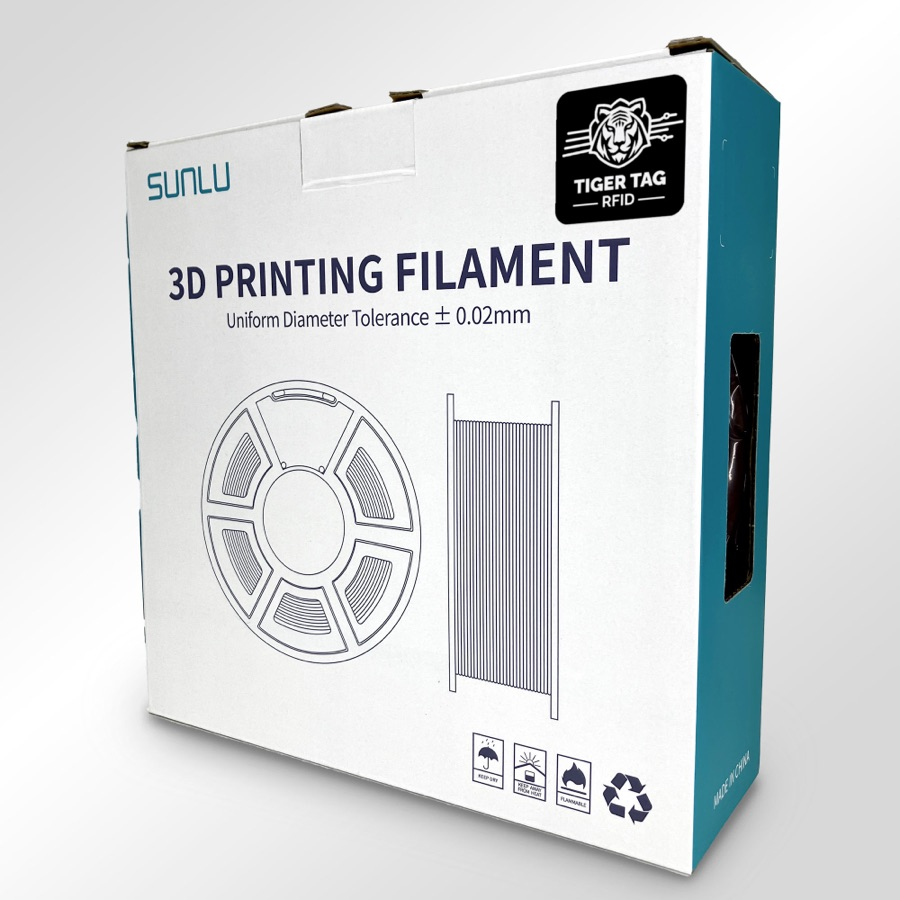 |

*Rosa3D, eSun, Sunlu — real boxes, shipping with TigerTag inside.*

| | | | |
|---|---|---|---|
| 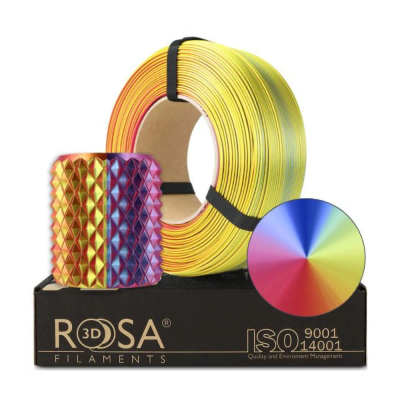 | 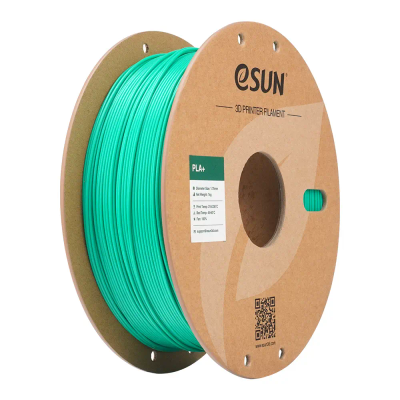 | 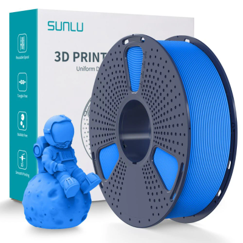 | 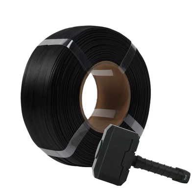 |

*The filament itself: Rosa3D, eSUN, Sunlu, R3D — every one of these ships
with TigerTag chips on the spool.*

## What your customers get on day one

A spool that identifies itself to **any NFC phone**, a full inventory
ecosystem (mobile, desktop, web), live integration with six printer brands,
weight tracking, sharing — an experience **far beyond what any closed
single-vendor environment offers**, and it works with every printer your
customers own, not just one brand's.

## Update the data even after it leaves your factory

A printed label is frozen the day it's printed. A TigerTag spool is not:
because chips resolve their identity against the **shared reference
database**, you can refine or correct a product's data — settings,
descriptions, imagery — **even for spools already sold and sitting in your
customers' homes**. TigerTag is the only technology on this market that keeps
your product's data updatable after it has left the factory.

## The collective play

Every filament brand that joins TigerSystem strengthens all the others:

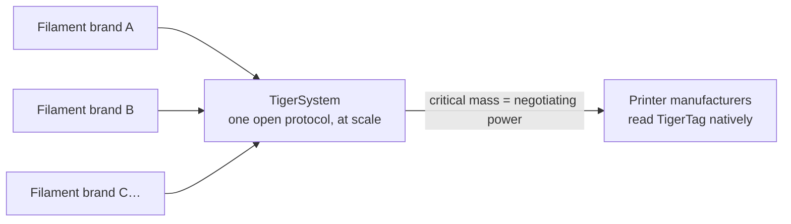

Alone, no filament brand can convince printer manufacturers to read its tags.
**Together, behind one open protocol, we can.** And the ask is small: a
printer maker can add TigerTag reading to its firmware in **under 3 days**. The more brands ship
TigerTag, the stronger the case for native, firmware-level TigerTag support
in the printers themselves — and every participant benefits from that
leverage.

---

**▲ [Documentation index](../../README.md)** · **Related:** [Why TigerSystem exists](./why-tigersystem.md), [Compatibility](../compatibility/README.md), [FAQ — Manufacturers](../faq/README.md)
