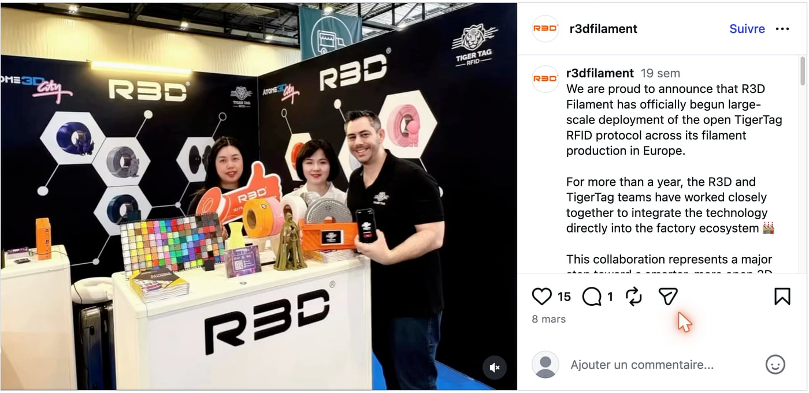
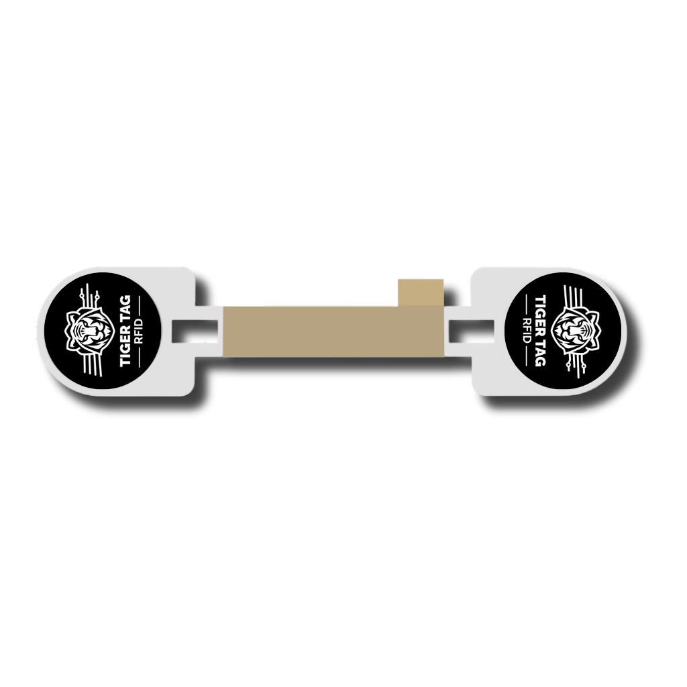
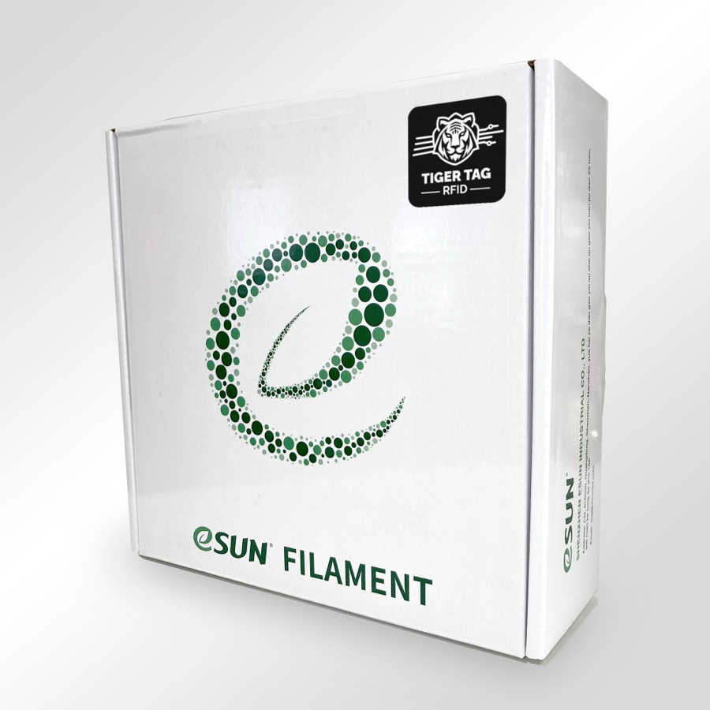
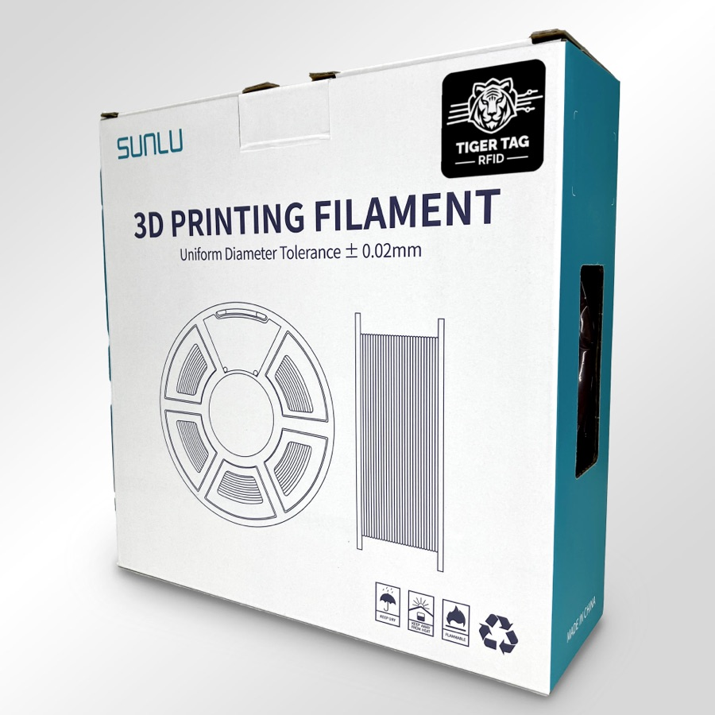
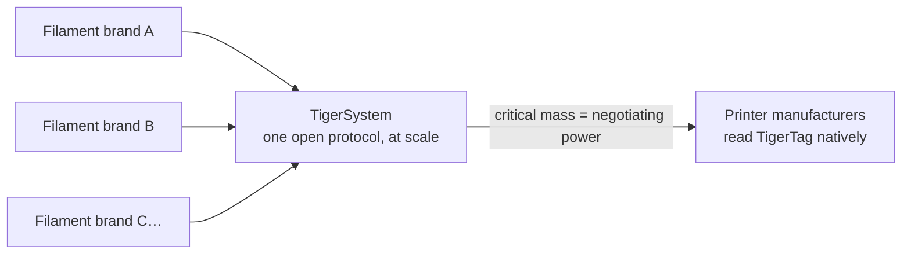

# For filament manufacturers

> **Make your spools smart and connected.**

## The smart spool is happening — the only open way to do it is here

Printers increasingly expect intelligent filament: AMS-class systems, per-slot
material detection, automatic settings. Every printer maker answers with a
**closed tag, locked to their machines, feeding their cloud** — zero
interoperability, zero value for your brand outside their walls. And every
locked tag serves a second purpose: **steering your customers toward the
printer maker's own filament.** TigerTag was created in 2023 precisely so
third-party brands would have a better answer — spools smarter than the
proprietary ones, without the walled garden.

**TigerTag is the most deployed third-party RFID protocol in the world** —
and, today, the only viable open smart-spool solution shipping at scale: an
open, standard, agnostic, cross-platform protocol with more than
**2.5 million chips already produced** and integrated at the factory by brands
like Rosa3D, eSun, Sunlu, Landu, Jamg He and R3D — with Filforme and
Nanovia being integrated.

## Factory integration: days, not months

We have the experience and the technology to get TigerTag chips into your
production line **quickly, easily, and at very low cost — up and running in
as little as 5 days**, writing **each chip in about 1 second** (thousands of
spools a day, one click):

- Standard NTAG hardware (no proprietary components, no tooling lock-in),
 sourced at a scale and cost chosen for one non-negotiable goal: **add the
 technology without adding one cent to the spool's end-user price.**
- A proven integration playbook already deployed in multiple factories,
 powered by the [TigerTag Factory & Manager](../products/factory-suite.md)
 industrial suite: your filament database on one side, line-speed mass
 writing into every spool on the other — with the **factory signature
 proving each product's origin**.
- The shared reference database gives your products a precise, universal
 identity every compatible app resolves identically.

Brands shipping TigerTags in their products can carry the **TigerTag
Certified** mark — a visible signal to customers that the spool is smart and
open.

> Reach out at **[tigertag@tigertag.io](mailto:tigertag@tigertag.io)** (or
> through the [GitHub organization](https://github.com/TigerTag-Project)) to
> start the conversation.

## Thank you, integrators

The brands below made the open spool real — each at its own level of
commitment, and every one of them deserves the credit. The tiers are a
**ladder**: the further a brand commits, the more prominently it appears —
here and across every surface of the ecosystem. The best stand tallest.

### Platinum — the summit

**TigerTag+ across the entire production**: every spool format, signed chips
as standard on every single spool leaving the factory. Nothing optional,
nothing partial — the full open-spool experience, for every customer, by
default. Platinum integrators get **top billing everywhere**: first named,
biggest logo, their story told.

**[Rosa3D](https://rosa3d.pl)** — the **world's first** integrator to put
TigerTag+ across its entire production. The reference everyone else is
chasing.

### Gold — committed, at scale

**Integration on demand at production time**, with large quantities already
produced, a high level of integration, and an **official public
commitment**. One step from the summit: make the signed chips standard
across the whole line, and join Platinum.

&nbsp;&nbsp;&nbsp;&nbsp;

**[R3D](https://r3dprint.com)** · **[eSun](https://www.esun3d.com)**

### Silver — on board

**The technology integrated on demand** — the first step, already a real
one: their customers can buy TigerTag-equipped spools today. The next rung
is Gold: scale the volumes and make the commitment public.

&nbsp;&nbsp;&nbsp;&nbsp;&nbsp;&nbsp;&nbsp;&nbsp;

**[Sunlu](https://www.sunlu.com)** · **[Landu](https://www.landustore.com)** · **[Jamg He](https://www.jamghe.com)**

…and more being integrated —
[Filforme](https://www.filforme.com), [Nanovia](https://nanovia.tech), and
others on the way.

**Want your logo on this ladder — and bigger?** A production line runs
TigerTag in as little as 5 days:
[tigertag@tigertag.io](mailto:tigertag@tigertag.io).

## They announced it themselves

Public posts on the brands' own channels — not our press release
(sources & full announcements:
[tigersystem.io/en/manufacturers](https://tigersystem.io/en/manufacturers)).
**Click any image to open the original post:**

|| | |
|---|---|---|
|  |  |  |

> **ROSA 3D FILAMENTS** — *"officially integrated the open TigerTag RFID
> protocol across 100 % of our filament production."* More than 250 000
> spools already produced with TigerTag.
> ([original post](https://www.instagram.com/p/DVyeOZajZSm/))

> **R3D Filament** — *"officially begun large-scale deployment of the open
> TigerTag RFID protocol across its filament production in Europe."*
> ([original post](https://www.instagram.com/reel/DVoAMqTk5ck/))

> **eSUN** — *"officially integrated TigerTag RFID technology!"* — piloting
> in the French market, expanding across Europe.
> ([original post](https://www.instagram.com/p/DUjydNXkc1W/))

## How the tags get into your spools

|| |
|---|---|
| **Front**  **Back**  |  |

*Front — the two branded chips, with the industrial 3M adhesive
(468MP / 200MP) in the middle. Back — the two independent NFC antennas, one
per end. Fitted on the refill: one chip per side, your operator peels and
sticks — nothing else on the line changes.*

## Already on the shelves

|| | |
|---|---|---|
|  |  |  |

*Rosa3D, eSun, Sunlu — real boxes, shipping with TigerTag inside.*

|| | | |
|---|---|---|---|
|  |  |  |  |

*The filament itself: Rosa3D, eSUN, Sunlu, R3D — every one of these ships
with TigerTag chips on the spool.*

## What your customers get on day one

A spool that identifies itself to **any NFC phone**, a full inventory
ecosystem (mobile, desktop, web), live integration with six printer brands,
weight tracking, sharing — an experience **far beyond what any closed
single-vendor environment offers**, and it works with every printer your
customers own, not just one brand's.

## Update the data even after it leaves your factory

A printed label is frozen the day it's printed. A TigerTag spool is not:
because chips resolve their identity against the **shared reference
database**, you can refine or correct a product's data — settings,
descriptions, imagery — **even for spools already sold and sitting in your
customers' homes**. TigerTag is the only technology on this market that keeps
your product's data updatable after it has left the factory.

## The collective play

Every filament brand that joins TigerSystem strengthens all the others:

```mermaid
flowchart LR
  B1["Filament brand A"] & B2["Filament brand B"] & B3["Filament brand C…"] --> TS["TigerSystem<br/>one open protocol, at scale"]
  TS -- "critical mass = negotiating power" --> PM["Printer manufacturers<br/>read TigerTag natively"]
```

Alone, no filament brand can convince printer manufacturers to read its tags.
**Together, behind one open protocol, we can.** And the ask is small: a
printer maker can add TigerTag reading to its firmware in **under 3 days**. The more brands ship
TigerTag, the stronger the case for native, firmware-level TigerTag support
in the printers themselves — and every participant benefits from that
leverage.

---

**▲ [Documentation index](../../README.md)** · **Related:** [Why TigerSystem exists](./why-tigersystem.md), [Compatibility](../compatibility/README.md), [FAQ — Manufacturers](../faq/README.md)
