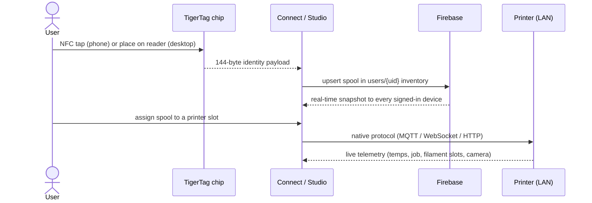
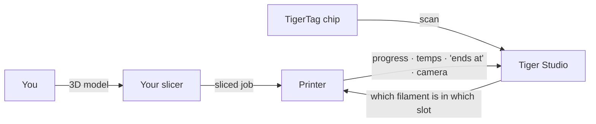

# Flux de données

## Du contact à l'impression

Le parcours complet d'une bobine à travers le système :

## Où réside chaque type de données

| Données | Résident dans | Remarques |
|---|---|---|
| Identité de la bobine | La puce + l'inventaire cloud de l'utilisateur | La puce fait foi pour l'usage hors ligne |
| Base de données de référence (marques, matières…) | `cdn.tigertag.io` (même projet Firebase) | Embarquée dans les applications, actualisée depuis le CDN |
| Images de bobines (photos produit TigerTag+ comprises) | `cdn.tigertag.io` (même projet Firebase) | Servies à toutes les applications |
| Inventaire, racks, amis, préférences | Firestore `users/{uid}/…` | Réservé au propriétaire par défaut, imposé par les règles |
| Codes de découverte publics | Firestore `publicKeys/{code}` | Recherche d'ami en O(1) |
| Identifiants et télémétrie imprimante | **En local uniquement** (bureau) | Le trafic LAN ne transite jamais par le cloud |
| Poids en direct (TigerScale) | Appareil → Firestore | Apparaît en direct dans tous les clients |

## Où se place votre trancheur

TigerSystem **ne remplace pas votre trancheur** — il complète le tableau
autour de lui :

- Vous tranchez et lancez vos impressions exactement comme avant, avec
 n'importe quel trancheur.
- Tiger Studio indique à l'imprimante **quel filament se trouve dans quel
 emplacement** (AMS / CFS / Canvas / ACE / station matière), pour que
 l'information côté machine corresponde à la réalité.
- Quelle que soit l'origine de l'impression, le travail apparaît en direct
 dans Tiger Studio — progression, températures, heure de fin, caméra.
- La puce porte les réglages d'impression recommandés du filament ; il n'y a
 **aujourd'hui aucun import automatique de profil de trancheur** — vous les
 reportez vous-même dans votre profil.

## Deux plans, délibérément séparés

- **Plan cloud** — identité, inventaire, partage. Internet, Firebase, imposé
 par les règles.
- **Plan LAN** — pilotage des imprimantes et caméras. Réseau local
 uniquement, protocoles natifs des constructeurs, zéro dépendance au cloud
 (l'application de bureau continue de fonctionner avec les imprimantes hors
 ligne).

> **Note :** l'exception est le **mode cloud** d'Anycubic, où la liaison avec
> l'imprimante passe elle-même par le MQTT cloud du constructeur — voir
> [Compatibilité Anycubic](../compatibility/anycubic.md).

---

**◀ Précédent :** [Vue d'ensemble de l'architecture](./overview.md) · **▲ [Index de la documentation](../../README.md)** · **Suivant ▶** [Produits](../products/README.md)

**Voir aussi :** [Inventaire et synchronisation cloud](../concepts/inventory-and-cloud-sync.md), [Compatibilité](../compatibility/README.md)
