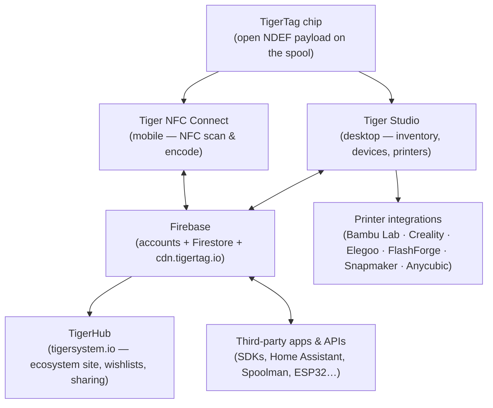
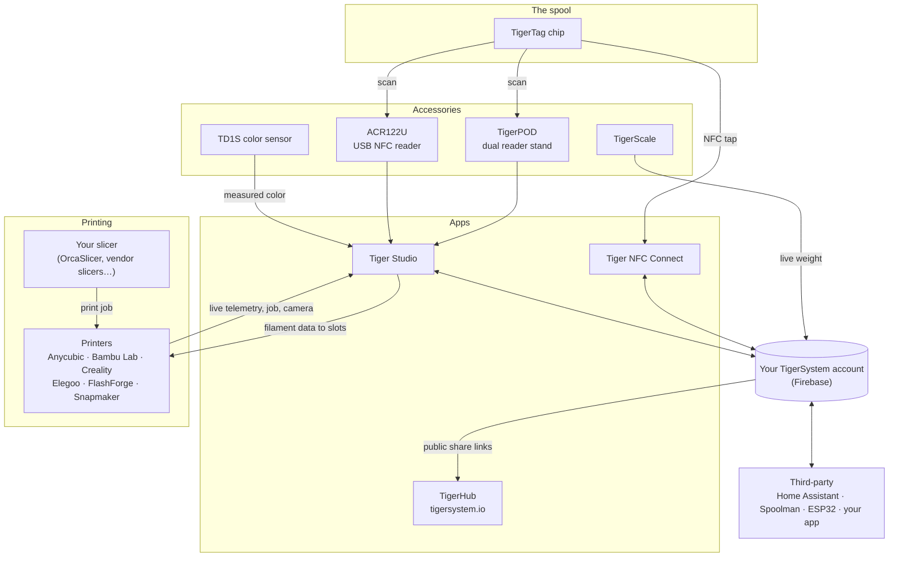

# Vue d'ensemble de l'architecture

## La pile, de haut en bas

## Les couches

| Couche | Rôle | Documentation de référence |
|---|---|---|
| **Puce TigerTag** | Identité ouverte et transportable de la bobine physique | [Format de la puce](../concepts/tigertag-chip.md) |
| **Tiger NFC Connect** | Le pont smartphone : scanner, encoder, parcourir | [Page produit](../products/tigertag-connect.md) |
| **Firebase** | Une base de données partagée — comptes, inventaire, synchronisation ; le point d'interopérabilité du bac à sable | [Inventaire et synchronisation cloud](../concepts/inventory-and-cloud-sync.md) |
| **TigerHub** | La maison web de l'écosystème : vitrine, listes d'envies, amis, partage | [Page produit](../products/tigerhub.md) |
| **Tiger Studio** | L'établi de bureau : inventaire, racks, capteurs, imprimantes | [Page produit](../products/tiger-studio.md) |
| **Intégrations imprimantes** | Liaisons LAN en direct avec six marques d'imprimantes | [Compatibilité](../compatibility/README.md) |
| **API tierces** | SDK + surface Firestore documentée, ouverte à tous | [Développeurs](../developers/README.md) |

## La carte complète — chaque élément et ses connexions

Accessoires, applications, cloud, imprimantes, trancheurs et intégrations
tierces, sur une seule image :

Lisez de gauche à droite : la **puce** identifie la bobine ; les
**accessoires** capturent le réel (scans, poids, couleur) ; les
**applications** et le **cloud** maintiennent l'ensemble synchronisé ;
l'**imprimante** reçoit les données de filament et rend compte en direct. Votre
**trancheur garde son rôle** — TigerSystem ne tranche pas, il fait en sorte que
tout le monde (vous, la machine, les applications) sache exactement quel
filament se trouve où.

## Principes de conception

1. **La puce se suffit à elle-même.** Une bobine s'identifie sans cloud, sans
 compte, sans réseau — la charge utile est complète et ouverte.
2. **Le cloud appartient à l'utilisateur, pas au système.** Tout l'état vit
 sous le compte de l'utilisateur ; ce sont des règles de sécurité côté
 serveur — et non le code client — qui contrôlent les accès.
3. **Chaque couche est optionnelle.** Un usage uniquement téléphone, uniquement
 bureau, uniquement puce ou uniquement API fonctionne ; les composants
 apportent de la valeur mais ne se conditionnent jamais les uns les autres.
4. **Les intégrations parlent le protocole natif de l'imprimante.** Pas de
 modification du firmware, pas de détour par le cloud : Tiger Studio parle
 MQTT/WebSocket/HTTP directement sur le LAN
 (voir [flux de données](./data-flow.md)).

---

**◀ Précédent :** [Inventaire et synchronisation cloud](../concepts/inventory-and-cloud-sync.md) · **▲ [Index de la documentation](../../README.md)** · **Suivant ▶** [Flux de données](./data-flow.md)

**Voir aussi :** [Produits](../products/README.md), [Développeurs](../developers/README.md)
