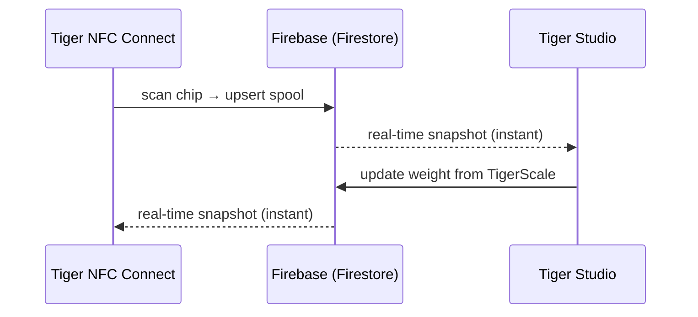

# Inventaire et synchronisation cloud

## Un compte, tous les appareils

L'inventaire d'un utilisateur réside dans **son compte TigerSystem**, adossé à
un simple **Firebase** (Auth + Firestore) — une infrastructure délibérément
sans marque, dont le rôle est simple : **une base de données partagée, en un
seul endroit**, pour que chaque élément du bac à sable (bureau, mobile,
balance, web) interopère sur les mêmes données. Chaque client — mobile,
bureau, web — s'abonne aux mêmes documents en temps réel :

Il n'y a pas de « bouton de synchronisation » : les changements se propagent
via les écouteurs temps réel de Firestore, et les clients gardent un cache
local pour la lecture hors ligne.

## Ce qui se synchronise

- **Inventaire** — un document par bobine (identité, poids, contenant, image…).
- **Racks** — l'agencement physique des étagères et le placement des bobines.
- **Amis et partage** — liens d'amitié, demandes reçues, notifications.
- **Préférences** — langue, réglages propres au compte.
- **Sauvegardes de puces** — les enregistrements de puces
 [TigerTag+](../products/tigertag-plus.md).

Le modèle de données faisant foi, champ par champ, est documenté dans le
[dépôt d'intégration Firebase](https://github.com/TigerTag-Project/TigerTag_Firebase_Integration)
(`docs/03-data-model.md`) — la référence pour les intégrateurs tiers.

## Modèle de partage (résumé)

- Chaque utilisateur dispose d'un **code de découverte** public (`XXX-XXX`)
 permettant une recherche d'ami en O(1).
- L'amitié est **bidirectionnelle et consentie** : demande → acceptation ;
 chacun des deux côtés peut la rompre. L'accès en lecture à l'inventaire d'un
 ami est imposé côté serveur par les règles de sécurité Firestore — jamais
 par le client.
- Un inventaire peut aussi être marqué **public**, ou partagé sous forme de
 liste web en lecture seule via des liens
 [TigerHub](../products/tigerhub.md).

## Modèle de sécurité (résumé)

- Toutes les données propres à un utilisateur lui sont réservées par défaut ;
 un accès inter-utilisateurs suppose toujours une relation préalable (amitié,
 demande), imposée par des règles côté serveur.
- La configuration du projet Firebase est publique à dessein (c'est le schéma
 standard) ; **la sécurité réside dans les règles, pas dans le secret**. Voir
 [API cloud et intégration](../developers/cloud-api.md).

---

**◀ Précédent :** [La puce TigerTag](./tigertag-chip.md) · **▲ [Index de la documentation](../../README.md)** · **Suivant ▶** [Vue d'ensemble de l'architecture](../architecture/overview.md)

**Voir aussi :** [TigerHub](../products/tigerhub.md), [Développeurs — API cloud](../developers/cloud-api.md)
