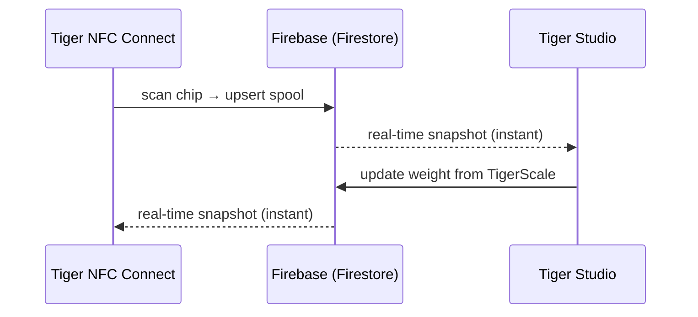

# Inventaire et synchronisation cloud

## Un compte, tous les appareils

L'inventaire d'un utilisateur réside dans **son compte TigerSystem**, adossé à
un simple **Firebase** (Auth + Firestore) — une infrastructure délibérément
sans marque, dont le rôle est simple : **une base de données partagée, en un
seul endroit**, pour que chaque élément du bac à sable (bureau, mobile,
balance, web) interopère sur les mêmes données. Chaque client — mobile,
bureau, web — s'abonne aux mêmes documents en temps réel :

Il n'y a pas de « bouton de synchronisation » : les changements se propagent
via les écouteurs temps réel de Firestore, et les clients gardent un cache
local pour la lecture hors ligne.

## Ce qui se synchronise

- **Inventaire** — un document par bobine (identité, poids, contenant, image…).
- **Racks** — l'agencement physique des étagères et le placement des bobines.
- **Amis et partage** — liens d'amitié, demandes reçues, notifications.
- **Préférences** — langue, réglages propres au compte.
- **Sauvegardes de puces** — les enregistrements de puces
 [TigerTag+](../products/tigertag-plus.md).

Le modèle de données faisant foi, champ par champ, est documenté dans le
[dépôt d'intégration Firebase](https://github.com/TigerTag-Project/TigerTag_Firebase_Integration)
(`docs/03-data-model.md`) — la référence pour les intégrateurs tiers.

## Ce qui sort de votre établi, et ce qui y reste

L'écosystème répète partout que le cloud est facultatif. Voici ce que cela
signifie concrètement, et ce que cela coûte de dire non.

**L'identification est locale par conception.** Un appareil ne demande pas à un
serveur ce qu'est une puce. Les tables de marques et de matières vivent dans sa
propre mémoire et sont rafraîchies depuis le
[dépôt de référence](https://github.com/TigerTag-Project/TigerTag-RFID-Guide)
**public** au plus une fois par jour. Une lecture n'attend donc jamais le
réseau, et elle fonctionne internet coupé.

**Sans compte, vous perdez exactement une chose : la synchronisation entre
appareils.** Une [TigerScale](../products/tigerscale.md) pèse toujours, lit
toujours les puces, identifie toujours la marque et la matière, et sert
toujours sa propre interface web sur votre réseau local. Rien de ce qui touche
à la puce elle-même n'a besoin de nous — c'est tout l'intérêt d'écrire les
données [sur la puce](./tigertag-chip.md).

**Avec un compte, voici ce qu'un appareil envoie réellement.** En prenant la
balance comme exemple : à chaque pesée terminée et à chaque battement de cœur,
elle écrit, sous votre propre document utilisateur, les UID des puces de la
bobine, les poids net / brut / du contenant, la version du firmware, la
puissance du signal WiFi et l'adresse IP, le facteur de calibration, l'horodatage
du dernier battement, l'état de la batterie et l'état de l'écran. Des mesures et
du diagnostic — rien d'autre. Chaque champ est documenté dans
[la référence de la balance](https://github.com/TigerTag-Project/Tiger-Scale-V3/blob/main/docs/TELEMETRY.md).

**Et voici ce qu'elle stocke localement, ce qui compte davantage.** Un appareil
connecté détient un jeton de rafraîchissement, votre identifiant utilisateur et
vos identifiants WiFi. Il ne stocke jamais votre mot de passe — la connexion
l'échange contre des jetons. Mais considérez un appareil provisionné comme
**détenant un identifiant** : avant de le prêter, de le vendre ou de le donner,
déconnectez-vous *et* oubliez le WiFi. Un simple reflash n'efface ni l'un ni
l'autre — cette mémoire est préservée volontairement, pour qu'une mise à jour du
firmware ne vous coûte pas votre configuration.

**Deux choix délibérés à connaître.** L'API locale d'un appareil n'est **pas
authentifiée** : quiconque est déjà sur votre réseau peut lire son état et
déclencher une tare. C'est une simplification assumée pour un réseau
domestique — placez l'appareil sur un VLAN invité si vous ne faites pas
confiance au vôtre. Et la clé Firebase visible dans les sources est un
**identifiant public de projet**, pas un secret : tous les clients Firebase
l'embarquent, et le contrôle d'accès est appliqué par des règles côté serveur
contre l'utilisateur connecté, pas en cachant une chaîne de caractères.

Pour la balance, tout cela est documenté en détail dans
[`docs/CLOUD.md`](https://github.com/TigerTag-Project/Tiger-Scale-V3/blob/main/docs/CLOUD.md),
qui fait foi.

## Modèle de partage (résumé)

- Chaque utilisateur dispose d'un **code de découverte** public (`XXX-XXX`)
 permettant une recherche d'ami en O(1).
- L'amitié est **bidirectionnelle et consentie** : demande → acceptation ;
 chacun des deux côtés peut la rompre. L'accès en lecture à l'inventaire d'un
 ami est imposé côté serveur par les règles de sécurité Firestore — jamais
 par le client.
- Un inventaire peut aussi être marqué **public**, ou partagé sous forme de
 liste web en lecture seule via des liens
 [TigerHub](../products/tigerhub.md).

## Modèle de sécurité (résumé)

- Toutes les données propres à un utilisateur lui sont réservées par défaut ;
 un accès inter-utilisateurs suppose toujours une relation préalable (amitié,
 demande), imposée par des règles côté serveur.
- La configuration du projet Firebase est publique à dessein (c'est le schéma
 standard) ; **la sécurité réside dans les règles, pas dans le secret**. Voir
 [API cloud et intégration](../developers/cloud-api.md).

---

**◀ Précédent :** [La puce TigerTag](./tigertag-chip.md) · **▲ [Index de la documentation](../../README.md)** · **Suivant ▶** [Vue d'ensemble de l'architecture](../architecture/overview.md)

**Voir aussi :** [TigerHub](../products/tigerhub.md), [Développeurs — API cloud](../developers/cloud-api.md)
