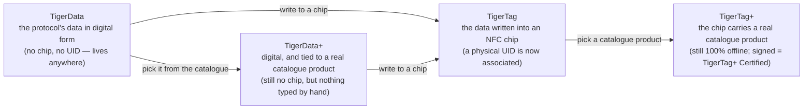

# Identité universelle du filament

## Une identité, lisible partout

Une puce TigerTag donne à une bobine une **identité universelle** : un
enregistrement unique et ouvert de ce que le filament *est*, indépendamment de
qui l'a fabriqué, de qui le vend et de l'imprimante qui le fera fondre.

Cette identité couvre (liste non exhaustive) :

| Famille de champs | Exemples |
|---|---|
| **Marque** | n'importe quel fabricant de filament, issu d'une liste de référence partagée |
| **Matière / type** | PLA, PETG, ABS, TPU… + sous-type |
| **Aspect / couleur** | valeur de couleur, finition |
| **Géométrie** | diamètre (1,75 / 2,85 mm) |
| **Réglages d'impression** | températures recommandées |
| **Cycle de vie** | poids, date de fabrication |

## La base de données de référence partagée

Les identités ne sont pas du texte libre : les marques, matières, aspects,
types, diamètres et unités proviennent d'une **base de données de référence
partagée** servie sur `cdn.tigertag.io` (hébergée dans le même projet Firebase
que les comptes). Chaque application résout les mêmes identifiants vers le même
sens : une puce encodée par un outil se lit à l'identique dans tous les autres.

> **TODO :** ajouter le lien vers le point d'accès public de consultation de la
> base / le format d'export dès que le guide RFID le documentera. Les données de
> référence sont livrées avec Tiger Studio (`assets/db/tigertag/`) et se
> rafraîchissent depuis le CDN.

## Une identité, quatre états

L'identité est l'*enregistrement*, pas la *puce* — et elle traverse quatre
états :

- **TigerData**, c'est le protocole *avant* la puce : la même identité, stockée
 sous forme numérique — dans un inventaire, une base de données, un fichier,
 n'importe où. Le protocole TigerTag peut vivre entièrement en dehors d'une
 puce RFID. Cette notion de **puce virtuelle est une innovation TigerSystem —
 elle n'existe nulle part ailleurs** : gérez un inventaire complet sans aucune
 puce NFC, envoyez une identité dans une puce plus tard ou jamais, et
 l'interopérabilité du protocole est préservée dans les deux cas.
- **TigerData+**, c'est un TigerData qui sait *exactement quel produit il est*.
 Toujours pas de puce, toujours rien à acheter — mais au lieu de ce que son
 propriétaire a saisi, il porte un vrai produit du catalogue officiel : la
 marque, la couleur, la matière, les températures, le diamètre, le SKU et l'EAN
 exacts, directement à la source. C'est ce que vous obtenez en choisissant un
 produit plutôt qu'en le décrivant.
 >Ce n'est **pas** un TigerTag+, et cela ne prétend jamais l'être : pas de puce,
 >pas d'UID. Le `+` veut dire *identifié*, pas *certifié*. Pour les
 >développeurs : une bobine est un TigerData+ quand elle est sans puce **et**
 >qu'elle porte un identifiant produit réel — cette paire est la définition, et
 >elle est recopiée sur l'enregistrement sous la forme `protocol: "TigerData+"`
 >afin que vous puissiez la lire directement. Voir la
 >[structure des données Firestore](https://github.com/TigerTag-Project/TigerTag_Firebase_Backend#-firestore-data-structure).
- Dès l'instant où ces données sont **écrites dans une puce NFC**, cela devient
 un **TigerTag** : un **UID** physique **est enfin associé** à l'identité.
- Écrivez un **produit du catalogue** dans cette puce plutôt que des valeurs
 saisies à la main et c'est un [**TigerTag+**](../products/tigertag-plus.md) —
 le même `+` que TigerData+, le même sens : *identifié*. Signé par un fabricant
 certifié, il devient un **TigerTag+ Certified**. Dans tous les cas, la puce
 reste lisible 100 % hors ligne.

Un TigerData peut rester numérique pour toujours, ou être **promu en puce réelle
de façon atomique** quand vous le décidez (Tiger Studio le fait en une seule
étape). Et les quatre états voyagent sous forme de fichiers : le
[**format d'échange `.ttag`**](../developers/ttag-format.md) transporte un ou
plusieurs matériaux d'inventaire — TigerData, TigerData+, TigerTag ou TigerTag+ —
sur une clé USB, dans un mail, d'un outil à l'autre.

---

**◀ Précédent :** [Le flux Seconde vie](../philosophy/second-life.md) · **▲ [Index de la documentation](../../README.md)** · **Suivant ▶** [La puce TigerTag](./tigertag-chip.md)

**Voir aussi :** [Page produit TigerTag](../products/tigertag.md), [Inventaire et synchronisation cloud](./inventory-and-cloud-sync.md)
