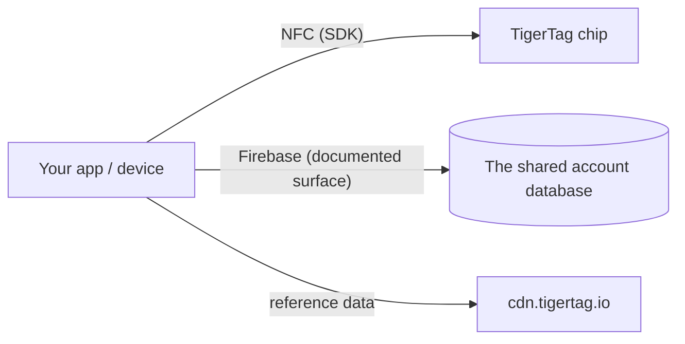

# Documentation développeur

Construisez sur TigerSystem : lisez des puces, dialoguez avec le cloud, ou
intégrez votre propre matériel et vos propres logiciels. Rien ne demande
d'autorisation — le protocole est ouvert.

## Que pouvez-vous construire ?

Lire un TigerTag demande **n'importe quel smartphone NFC**, un **lecteur USB
ACR122U** branché sur un ordinateur, ou un **appareil DIY — un simple ESP32
avec un module lecteur PN532 ou RC522** (l'approche retenue par TigerScale).
Du matériel courant, rien de propriétaire. À partir de ce seul scan, intégrez
partout où une identité est utile :

- **ERP / gestion de stock** — reliez l'identité et les quantités des bobines
 au système d'inventaire existant de votre entreprise.
- **Suivi de consommation** — enregistrez quel matériau est parti dans quel
 travail, quelle machine ou quelle commande client.
- **Tableaux de bord et automatisations sur mesure** — supervision de ferme
 d'impression, alertes de stock bas, déclenchement de réapprovisionnement.
- **Systèmes de prêt** — fablabs, écoles, makerspaces qui gèrent les entrées
 et les sorties de matière.
- **Projets de R&D, privés ou publics** — un support d'identité ouvert,
 réinscriptible et documenté avec lequel expérimenter.

Aucun de ces usages n'a besoin de nos applications ni de notre cloud : la puce
+ un SDK suffisent. N'ajoutez la [surface cloud](./cloud-api.md) que si vous
voulez des comptes et de la synchronisation.

Construisez-le et il est **TigerTag Compatible** : gratuit, auto-déclaré, sans
audit et sans autorisation. Passez-le à l'audit et il peut devenir **TigerTag
Certified** — ouvert à tout ce que construit un tiers, matériel ou logiciel,
dans deux périmètres (**TigerTag** et **TigerTag+**). Ce qui sépare les paliers
n'est pas la nature de votre produit ; c'est le fait que quelqu'un ait vérifié
ou non. Compatible dit *« ça marche »* sur votre parole, Certifié dit *« nous
l'avons testé »* sur la nôtre
([critères](https://github.com/TigerTag-Project/TigerTag-RFID-Guide/blob/main/CERTIFICATION.md), contactez-nous via l'[organisation GitHub](https://github.com/TigerTag-Project)).

La gouvernance comporte délibérément deux portes : **n'importe qui** peut
implémenter le protocole et dire « compatible avec TigerTag » — sans
autorisation, jamais — et afficher le logo TigerTag, non modifié, pour le dire :
dans votre application, votre documentation, votre fiche en boutique. Cet usage
référentiel est libre. Seuls les **partenaires certifiés** (listés dans le
registre des certifiés) peuvent apposer la marque **sur une puce, un support,
une bobine ou un emballage**, où elle cesse de décrire une compatibilité pour
affirmer une origine, et eux seuls peuvent émettre des **signatures TigerTag+**
(TigerTag détient la clé privée). La porte de la marque relève du marketing ;
la porte de la signature relève de la technique ; **aucune des deux ne
restreint le protocole d'une seule ligne** — une puce non certifiée fonctionne
parfaitement, elle ne peut simplement pas prouver son origine.

Deux détails qu'il vaut mieux avoir exactement justes. La revendication de
compatibilité couvre **aussi le palier `+`** : vérifier une signature TigerTag+
est gratuit, hors ligne et sans restriction — les clés publiques sont publiées —
de sorte qu'un lecteur qui les vérifie peut dire *« compatible avec
TigerTag+ »*. Ce qu'il ne peut pas faire, c'est appeler **une étiquette** un
TigerTag+ si cette étiquette ne porte pas réellement une signature émise par
TigerTag. Et le mot **« certifié » ne s'attribue jamais soi-même** :
TigerSystem l'accorde, personne ne le revendique.

C'est délibérément le modèle qu'utilisent Zigbee et Matter — un palier
*Compatible* gratuit, ouvert à tous, et un palier *Certifié* accordé, qui
signifie quelque chose pour l'acheteur précisément parce qu'il est accordé.
Politique complète, paliers de certification et éléments de marque :
[TRADEMARK.md](https://github.com/TigerTag-Project/TigerTag-RFID-Guide/blob/main/TRADEMARK.md) et
[CERTIFICATION.md](https://github.com/TigerTag-Project/TigerTag-RFID-Guide/blob/main/CERTIFICATION.md).

## Par où commencer

| Je veux… | À lire |
|---|---|
| Voir qui a déjà construit sur TigerTag | [Intégrations tierces](./integrations.md) |
| Comprendre les briques | [Vue d'ensemble de l'architecture](../architecture/overview.md) |
| Savoir quel dépôt fait quoi | [Dépôts](./repositories.md) |
| Lire et écrire des puces TigerTag | [SDK](./sdks.md) |
| Échanger des inventaires sous forme de fichiers | [Le format `.ttag`](./ttag-format.md) |
| Afficher la couleur d'une bobine comme le font toutes les autres applications | [La pastille de matière](./material-swatch.md) — et son [moteur de rendu de référence en direct](./material-swatch-playground.html) |
| Synchroniser avec l'inventaire cloud de l'utilisateur | [API cloud et intégration](./cloud-api.md) |
| Comprendre la charge utile de la puce | [La puce TigerTag](../concepts/tigertag-chip.md) |

## Chemins d'intégration

1. **Puce seule** — analysez et encodez les puces avec un SDK. Pas de compte,
 pas de réseau.
2. **Connecté au cloud** — authentifiez le *compte de l'utilisateur lui-même*
 et lisez/écrivez ses données dans le cadre des règles de sécurité côté serveur
 ([contrat d'intégration](./cloud-api.md)).
3. **Matériel** — des exemples fonctionnels existent pour ESP32/Arduino, Home
 Assistant et une passerelle Spoolman (voir les
 [exemples du dépôt d'intégration](https://github.com/TigerTag-Project/TigerTag_Firebase_Integration/tree/main/examples)).

## Conventions

- **Gestion des versions** — les publications de produits suivent SemVer ; la
 charge utile de la puce porte sa propre version de format pour la
 rétrocompatibilité.
- **Nommage** — des noms auto-descriptifs plutôt qu'encodés ou astucieux ; pas
 de valeurs magiques à états multiples.
- **Couleur** — la couleur d'une bobine est stockée comme une donnée, pas comme
 une image, donc chaque surface doit transformer cette donnée en la même image :
 [la convention de la pastille de matière](./material-swatch.md) est normative,
 et s'accompagne d'un [moteur de rendu de référence](./material-swatch-playground.html)
 auquel confronter votre propre implémentation.
- **Contributions** — chaque dépôt a son propre guide ; les contributions à la
 documentation suivent le [CONTRIBUTING.md](../../CONTRIBUTING.md) d'ici.

---

**◀ Précédent :** [OpenSpool](../compatibility/openspool.md) · **▲ [Index de la documentation](../../README.md)** · **Suivant ▶** [Dépôts](./repositories.md)
