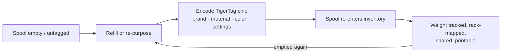

# Le flux Seconde vie

## Le problème des bobines « intelligentes » d'aujourd'hui

Quand une bobine taguée par un fabricant se vide, le tag meurt avec elle : il décrivait
une bobine remplie en usine, dans le format d'un seul constructeur, et il ne peut pas
être réutilisé. Le support de bobine finit à la poubelle ou rechargé « bêtement ».

## Seconde vie : réidentifier plutôt que jeter

Une puce TigerTag est **inscriptible et réinscriptible**. Quand une bobine est vidée puis
rechargée — ou quand une bobine, quelle que soit sa marque, ne porte aucun tag utile —
l'utilisateur encode une puce TigerTag avec le profil réel du nouveau filament et la colle
dessus. La bobine reçoit une *seconde vie* d'objet à part entière, capable de s'identifier :

*Même une recharge sans bobine porte son identité — la puce voyage avec la couronne elle-même.*

## Comment se passe l'encodage

- **Tiger NFC Connect** (mobile) — programmez les puces par simple contact NFC.
- **Tiger Studio** (bureau) — mise à jour guidée de la puce avec un lecteur ACR122U /
 [TigerPOD](../products/tigerpod.md) : posez la puce, vérification de correspondance de
 l'UID, écriture vérifiée.
- **Le numérique d'abord** — le *TigerData* de Tiger Studio vous laisse créer une bobine
 entièrement numérique (sans puce) maintenant et **la promouvoir en puce réelle plus tard, de façon atomique**.

> **Note :** le catalogue des marques, matières et couleurs utilisé lors de l'encodage est
> servi par la [base de données de référence](../concepts/universal-filament-identity.md) partagée, si bien
> qu'une puce réencodée est aussi précise qu'une puce d'usine.

## La seconde vie de la puce elle-même — zéro déchet électronique

La bobine n'est pas la seule à recevoir une seconde vie : **les puces aussi.**
Chaque bobine porte [deux puces](../concepts/tigertag-chip.md) — donc chaque kilo
de filament que vous imprimez vous laisse **deux puces NTAG standard** à récupérer.
Décollez-les et réencodez-les en NDEF simple pour n'importe quel usage : un porte-clés
intelligent, une carte de visite NFC, un objet connecté à vous — l'éditeur est intégré à
l'application. Elle peut même réécrire une puce **dans le format qu'attendent les
imprimantes Elegoo** : votre puce, votre choix.

C'est exactement pour cela que la production des puces officielles de marque est passée au
**NTAG215** : plus de marge mémoire, donc plus de réemplois possibles une fois la bobine
vide. L'objectif est simple — **la puce d'une bobine ne devrait jamais devenir un déchet électronique.**

---

**◀ Précédent :** [Pont smartphone](./smartphone-bridge.md) · **▲ [Index de la documentation](../../README.md)** · **Suivant ▶** [Identité universelle du filament](../concepts/universal-filament-identity.md)

**Voir aussi :** [TigerTag](../products/tigertag.md), [TigerTag+](../products/tigertag-plus.md)
