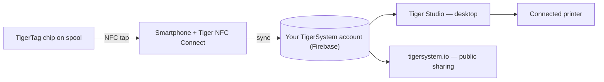

# Le concept du pont smartphone

## L'intuition de départ

> En Chine, nous n'arrêtions pas de demander : *« Où sont les lecteurs
> RFID ? »* Tout le monde répondait : *« Dans les Bambu Lab. »* Faux — les
> lecteurs de Bambu sont dans l'AMS, pas dans l'imprimante ; la machine est
> tout bonnement incapable de détecter une bobine tierce. **Les lecteurs RFID
> sont dans vos poches** — dans chaque téléphone, prêts à servir, sans même
> que vous le sachiez.

Chaque smartphone moderne contient un lecteur NFC. Autrement dit, **tout
utilisateur d'impression 3D possède déjà du matériel TigerTag** — pas de
lecteur propriétaire, pas de mise à niveau d'imprimante, aucun achat pour
commencer.

Le téléphone joue le rôle de **pont** entre la bobine physique et l'inventaire
numérique :

1. **Approchez** — le profil de la puce (marque, matière, couleur, réglages) est lu en un geste.
2. **Synchronisation** — la bobine apparaît instantanément dans l'inventaire cloud de l'utilisateur.
3. **Partout** — l'application de bureau, le web et les imprimantes connectées connaissent désormais la bobine.

## RFID natif face au pont

Certaines imprimantes lisent les tags nativement — en général dans leur propre
format propriétaire, parfois le TigerTag lui-même ; la plupart ne lisent rien
du tout. Le pont rend les capacités de l'imprimante sans importance :

| Voie | Nécessite | Fonctionne avec |
|---|---|---|
| **RFID natif — tag constructeur** | Une imprimante qui lit le tag verrouillé de ce constructeur | Une seule marque |
| **RFID natif — TigerTag** | Une machine dont le firmware lit lui-même le TigerTag — rare, et jusqu'ici issu de la communauté | Toutes les marques, sans application dans la boucle |
| **Pont smartphone** | N'importe quel téléphone NFC | **Toutes les imprimantes**, toutes les marques, même les machines totalement hors ligne |

La ligne du milieu n'est pas de notre fait, et elle est récente. Le firmware
étendu de la communauté fait de la [Snapmaker U1](../compatibility/snapmaker.md)
la première imprimante à lire un TigerTag sur la machine elle-même ; et le
**BT-AMS-C**, un lecteur quatre slots qui se monte sur un AMS Bambu Lab, envoie
les données du TigerTag directement au BMCU de l'imprimante
([matériel tiers](../compatibility/third-party-hardware.md)). Les deux restent
des exceptions — ce qui plaide pour le pont plutôt que contre lui : il n'a
jamais eu à les attendre.

Avec le pont, les données du filament atteignent l'imprimante via les
[intégrations d'imprimantes de Tiger Studio](../compatibility/README.md) (six
marques opérationnelles à ce jour) — la bobine se présente au *système*, et le
système parle à la machine.

La preuve par l'exemple : **les imprimantes FlashForge n'ont aucun lecteur
RFID** — et grâce au pont, elles fonctionnent malgré tout avec du filament
identifié par NFC. Une capacité entièrement nouvelle, ajoutée aux machines de
quelqu'un d'autre, **totalement gratuite pour l'utilisateur**
([le cas FlashForge](../compatibility/flashforge.md)).

---

**◀ Précédent :** [Écosystème ouvert](./open-ecosystem.md) · **▲ [Index de la documentation](../../README.md)** · **Suivant ▶** [Le flux Seconde vie](./second-life.md)

**Voir aussi :** [Tiger NFC Connect](../products/tigertag-connect.md), [Vue d'ensemble de l'architecture](../architecture/overview.md)
