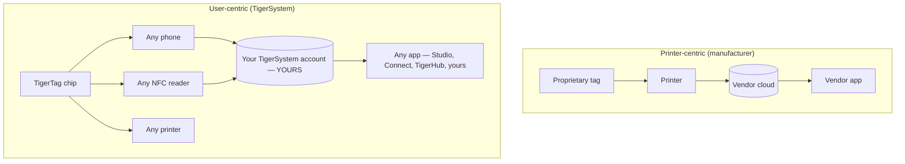

# Centré sur l'utilisateur ou centré sur l'imprimante

> **L'intelligence au service de l'utilisateur — pas seulement de l'imprimante.**

## Deux architectures opposées

Dans un monde centré sur l'imprimante, c'est l'**imprimante** qui est au centre :
la puce existe pour servir la machine, et les données s'écoulent vers le silo du
fabricant.

Dans TigerSystem, c'est l'**utilisateur** qui est au centre. L'utilisateur
possède :

- **le filament** — n'importe quelle marque, n'importe quel vendeur ;
- **les métadonnées** — matériau, couleur, réglages d'impression, encodés sur une puce qu'il maîtrise ;
- **l'inventaire** — stocké sous son propre compte cloud, exportable ;
- **l'historique** — poids, emplacements, usage au fil du temps ;
- **la synchronisation** — le même compte alimente chaque application et chaque appareil.

TigerSystem se contente de **relier tous les composants entre eux**.

## Pourquoi les fabricants verrouillent la RFID

Les puces des fabricants sont généralement verrouillées cryptographiquement
(voir la [section compatibilité](../compatibility/README.md) pour le détail
constructeur par constructeur : clés dérivées de l'UID, secteurs chiffrés en
AES, signatures RSA). Le verrouillage sert le vendeur : il lie l'achat des
consommables à la machine et garde la chaîne de données propriétaire. Il signifie
aussi que **votre propre inventaire de bobines ne vous appartient pas**.

Les puces TigerTag prennent le parti inverse : une charge utile NDEF ouverte sur
une puce NTAG standard, documentée publiquement, avec des SDK ouverts pour la
lire et l'écrire.

---

**◀ Précédent :** [Pourquoi TigerSystem existe](../vision/why-tigersystem.md) · **▲ [Index de la documentation](../../README.md)** · **Suivant ▶** [Écosystème ouvert](./open-ecosystem.md)

**Voir aussi :** [Identité universelle du filament](../concepts/universal-filament-identity.md), [Compatibilité](../compatibility/README.md)
