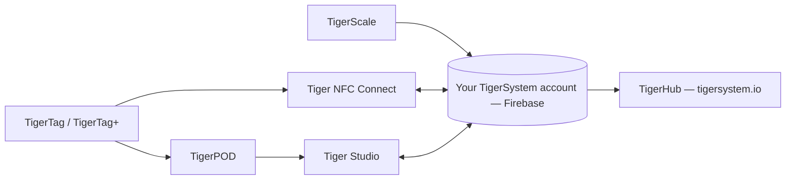

# Produits

L'écosystème TigerSystem, une page par produit.

**Voici les produits officiels** — conçus et publiés par TigerSystem.
« Officiel » signifie ici *c'est nous qui l'avons fait*, pas *il vous le faut* :
chacun est open source et forkable, et leurs noms (Tiger Studio, TigerHub,
TigerScale, TigerPOD, Tiger NFC Connect) ne sont **délibérément pas revendiqués
comme marques**. Seule la marque **TigerTag** est réservée, et uniquement pour
la puce.

N'importe qui peut construire et vendre une alternative — un lecteur, une
application, une balance, un système d'inventaire complet. Voir
[matériel tiers](../compatibility/third-party-hardware.md) et
[logiciels bâtis sur TigerTag](../developers/integrations.md) pour ce qui
existe déjà. Un produit tiers est **TigerTag Compatible** du simple fait qu'il
fonctionne ; il ne devient **TigerTag Certified** que si TigerSystem le lui
accorde ([politique de marque](../../TRADEMARK.md)).

> **Note :** chaque produit **destiné aux utilisateurs** ci-dessous — et tous
> ceux à venir — est une **preuve de concept** fonctionnelle. Leur seul but est
> de montrer le potentiel d'un protocole open source, standard, agnostique et
> multiplateforme, et d'inspirer ce que d'autres construiront avec. (La chaîne
> d'outils de programmation des puces côté usine, c'est une autre histoire :
> qualité industrielle, en production.) Voir
> [Un bac à sable, délibérément](../vision/why-tigersystem.md).

| Produit | Ce que c'est | Type |
|---|---|---|
|  [TigerData](../concepts/universal-filament-identity.md) | La puce virtuelle — l'identité sous forme numérique, sans puce, évolutive à tout moment | Concept |
|  [TigerTag](./tigertag.md) | Puce RFID/NFC ouverte + standard d'identité de bobine | Matériel + spécification |
|  [TigerTag+](./tigertag-plus.md) | Un TigerTag sauvegardé dans votre compte — restauration de l'état d'usine sur la puce d'origine | Matériel + service |
|  [Tiger NFC Connect](./tigertag-connect.md) | Application mobile (iOS/Android) — scanner, encoder, parcourir | Application |
|  [Tiger Studio](./tiger-studio.md) | Application de bureau — inventaire, racks, capteurs, imprimantes | Application |
|  [TigerHub](./tigerhub.md) | La maison web de l'écosystème — vitrine, listes d'envies, amis et partage sur `tigersystem.io` | Web |
|  [TigerPOD](./tigerpod.md) | Support de lecteur NFC double, imprimable en 3D | Matériel |
|  [TigerScale](./tigerscale.md) | Balance à filament open source à base d'ESP32 | Matériel |
|  [TigerTag Factory & Manager](./factory-suite.md) | Outils industriels de programmation de puces et de base de données filaments pour les usines — **non publics**, de qualité production | Industriel |

---

**◀ Précédent :** [Flux de données](../architecture/data-flow.md) · **▲ [Index de la documentation](../../README.md)** · **Suivant ▶** [TigerTag](./tigertag.md)
