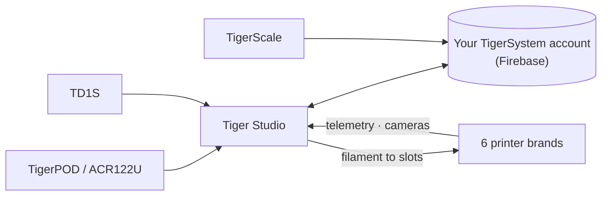

# Tiger Studio (application de bureau)

## Objectif

**Tiger Studio est le centre de contrôle de votre filament.** Chaque bobine,
chaque rack, chaque imprimante sur un seul écran — scannez une puce et sa
bobine s'ouvre, mettez un poids à jour et il se synchronise partout, jetez un
œil à une imprimante et voyez ce qu'elle fait à l'instant même. Open source,
sur Windows / macOS / Linux.

<a class="ts-cta-primary" href="https://github.com/TigerTag-Project/TigerTag-Studio-Manager/releases/latest">Télécharger Tiger Studio</a>
<a href="https://github.com/TigerTag-Project/TigerTag-Studio-Manager"> Les sources — GitHub</a>

C'est délibérément **un laboratoire, pas la destination** — une démonstration
de ce que le protocole ouvert rend possible, lisible, forkable et libre de
copie ([philosophie](../philosophy/open-ecosystem.md)).

## Où cela se situe

## Fonctionnalités (les principales)

- **Inventaire** — synchronisation Firestore en temps réel, vues tableau/grille,
 panneau de détail, suivi du poids, calibration des contenants, bobines
 numériques (TigerData) avec promotion atomique vers une puce.
- **Imprimantes** — intégrations en direct pour **6 marques** (télémétrie,
 filament par emplacement, avancement des travaux, caméras, et pour certaines
 marques des panneaux de contrôle complets). Voir la
 [compatibilité](../compatibility/README.md).
- **Racks** — cartographie du rangement physique par glisser-déposer.
- **Amis et partage** — codes de découverte, inventaires d'amis en lecture seule.
- **Périphériques** — de première partie : [TigerPOD](./tigerpod.md) et
 [TigerScale](./tigerscale.md) ; de tierce partie : le lecteur NFC ACR122U, les
 analyseurs **AJAX-3D TD-1 et TD1s** (TD + couleur directement dans le profil de
 la bobine) et les **balances USB HID** (série DYMO M et toute balance
 conforme) — liste complète : [matériel tiers compatible](../compatibility/third-party-hardware.md).
- **9 langues** — EN · FR · DE · ES · IT · PL · PT-BR · PT-PT · 中文.

Le catalogue complet et toujours à jour vit dans le dépôt de l'application,
dans [FEATURES.md](https://github.com/TigerTag-Project/TigerTag-Studio-Manager/blob/main/FEATURES.md).

## Architecture

Electron + JS natif, sans bundler. Les liaisons imprimantes parlent directement
le **protocole LAN natif** de chaque fabricant (MQTT / WebSocket / HTTP) — les
notes de protocole par marque sont tenues à jour dans le dépôt de l'application
(`renderer/printers/<brand>/PROTOCOL.md`).

## En images

## Liens

- Dépôt + téléchargements : [TigerTag-Studio-Manager](https://github.com/TigerTag-Project/TigerTag-Studio-Manager) (MIT)
- Catalogue complet des fonctionnalités : [FEATURES.md](https://github.com/TigerTag-Project/TigerTag-Studio-Manager/blob/main/FEATURES.md)

---

**◀ Précédent :** [Tiger NFC Connect](./tigertag-connect.md) · **▲ [Index de la documentation](../../README.md)** · **Suivant ▶** [TigerHub](./tigerhub.md)

**Voir aussi :** [Compatibilité](../compatibility/README.md), [Architecture](../architecture/overview.md)
