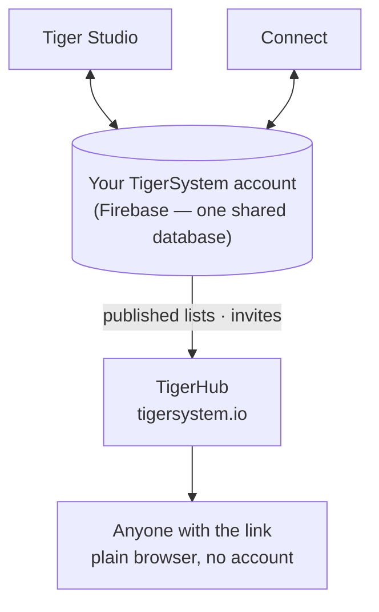

# TigerHub

## Objectif

**TigerHub est la maison de l'écosystème sur le web** — le site
**[tigersystem.io](https://tigersystem.io)**. Il présente le bac à sable
TigerSystem et ce que le protocole ouvert TigerTag rend possible, et il héberge
le **volet social** du bac à sable : partager une liste de souhaits, inviter
quelqu'un à devenir ami, publier une liste en lecture seule que n'importe qui
peut ouvrir dans un navigateur.

## Où cela se situe

## Fonctionnalités — toutes en service aujourd'hui

- **Vitrine de l'écosystème** — la page d'accueil raconte toute l'histoire :
 comment cela fonctionne, les six marques d'imprimantes, les composants et les
 trois niveaux (TigerData — suivi purement logiciel · TigerTag — la puce hors
 ligne · TigerTag+ — authenticité vérifiée).
- **Votre compte sur le web** (`/account`) — connectez-vous à votre compte
 TigerSystem depuis un navigateur.
- **Listes de souhaits** — publiques ou réservées aux amis, les deux déployées.
- **Codes d'ami et invitations** — ajoutez-vous mutuellement comme amis depuis
 le web.
- **Liens de listes publiques** — partagez un inventaire ou une liste de
 souhaits en lecture seule sous la forme
 `https://tigersystem.io/list/<token>` ; le visiteur n'a besoin ni
 d'application ni de compte.
- **Catalogue de matières et base de référence** (`/materials`, `/database`) —
 parcourez le catalogue partagé auquel toutes les applications se réfèrent.
- **Imprimantes et fonctionnalités** (`/printers`, `/features`) — ce qui
 fonctionne avec quoi.
- **Modèles 3D** (`/models`) — des modèles imprimables (TigerPOD et compagnie).
- **Pour les fabricants, les développeurs et la presse** (`/manufacturers`,
 `/developers`, `/press`) — le discours B2B, les points d'entrée pour
 l'intégration, les ressources média.
- **Goodies** (`/goodies`) — la casquette et le polo officiels. En acheter est
 l'une des façons de [soutenir le projet](../support.md).

## TigerHub n'est pas la base de données

Les comptes utilisateurs et les données derrière toutes les applications vivent
dans **Firebase, tout simplement** (Auth + Firestore) — une infrastructure
délibérément sans marque : **une seule base de données partagée, en un seul
endroit**, pour que Tiger Studio, Tiger NFC Connect, TigerScale et le compte
TigerSystem interopèrent tous sur les mêmes données. TigerHub est la **surface
web** bâtie par-dessus. Voir
[Inventaire et synchronisation cloud](../concepts/inventory-and-cloud-sync.md).

## Interactions

| Avec | Comment |
|---|---|
| Tiger Studio / Connect | Générer et révoquer des liens de partage, envoyer des invitations d'ami |
| Firebase (base de données des comptes) | Source des données publiées |
| Visiteurs | Simple navigateur, aucun compte nécessaire |

---

**◀ Précédent :** [Tiger Studio](./tiger-studio.md) · **▲ [Index de la documentation](../../README.md)** · **Suivant ▶** [TigerPOD](./tigerpod.md)

**Voir aussi :** [Inventaire et synchronisation cloud](../concepts/inventory-and-cloud-sync.md), [Architecture](../architecture/overview.md)
