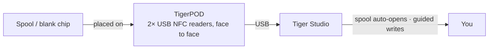

# TigerPOD

## Objectif

**Le premier « lecteur CD » pour bobines de filament intelligentes.** TigerPOD
pose un scanner de bobines sur votre bureau — et c'est vous qui l'imprimez.
Un support imprimable en 3D, gratuit et open source, qui accueille **deux**
lecteurs NFC USB **face à face** : posez une bobine, elle se présente dans Tiger
Studio ; posez une puce vierge, encodez-la. Aussi naturel que d'approcher un
téléphone, mais mains libres sur le bureau.

## Pourquoi deux lecteurs, face à face

C'est toute la raison d'être de la coque, et le point à ne pas manquer. **Nous
recommandons deux lecteurs, toujours.** Un seul lecteur fonctionne
techniquement, mais dégrade l'expérience sur deux points concrets :

- **En lecture.** Une bobine porte
 [**deux puces, sur les faces opposées**](../concepts/tigertag-chip.md). Avec un
 seul lecteur, une bobine qui se présente « dans le mauvais sens » doit être
 reprise en main et retournée avant d'être vue. Avec un lecteur de chaque côté,
 quel que soit le sens dans lequel vous posez la bobine, une puce est déjà face
 à un lecteur. Rien à retourner, rien à viser.
- **En écriture.** Quand vous taguez une bobine vous-même, vous écrivez les
 **deux** puces. Un seul lecteur, c'est deux passes, et deux occasions de les
 désaccorder. Deux lecteurs écrivent la paire **d'un coup**, et Tiger Studio
 peut les vérifier l'une par rapport à l'autre.

Le POD existe pour tenir cette géométrie : deux lecteurs, debout, face à face, à
distance de bobine. Tout le reste n'est qu'une coque autour.

## Où cela se situe

## Deux coques à imprimer — les deux gratuites

| | **TigerPOD Mini** — *recommandé* | **TigerPOD (original)** |
|---|---|---|
| |  |  |
| Impression | Plus rapide, moins de filament | Plus longue, plus de filament |
| Place sur le bureau | Moins | Plus |
| Câbles | Passés **à l'intérieur** de la coque | À l'extérieur |
| Puces | TigerTag **et** OpenSpool (NDEF) | TigerTag **et** OpenSpool (NDEF) |
| Téléchargement | **[MakerWorld — TigerPOD Mini](https://makerworld.com/fr/models/3190348-tigerpod-mini-for-openspool-tigertag-rfid-filament#profileId-3609236)** | **[MakerWorld — TigerPOD original](https://makerworld.com/fr/models/1289152-tigerpod-for-openspool-tigertag-rfid-filament#profileId-1318958)** |

Les deux accueillent les mêmes deux lecteurs de la classe ACR122U, face à face.
Le Mini est une refonte de l'original et c'est tout simplement le meilleur des
deux : commencez par lui, sauf si vous tenez au berceau plus grand.

Sous licence **CC BY 4.0** — remixez et adaptez librement.

## De quoi il est fait

Le STL, c'est la coque ; voici les pièces qui vont dedans. Rien n'est exclusif —
n'importe quel lecteur de la classe ACR122U et n'importe quel séparateur USB-C
conviennent — mais c'est la combinaison autour de laquelle la coque est dessinée :

| Pièce | Quantité | Ce que c'est |
|---|---|---|
| **TigerTag Player** | **2** | Le lecteur NFC USB — un appareil de la classe ACR122U. Un par face, pour atteindre les deux puces de la bobine en un seul passage. |
| **TigerTag Spliter** | 1 | USB-C vers 2× USB-A, pour que les deux lecteurs rejoignent l'ordinateur sur un seul port et puissent être programmés en parallèle. |
| **La coque imprimée** | 1 | **Mini** ou original — voir ci-dessus. |

### Se procurer les pièces

La coque est un téléchargement gratuit ; ce que vous achetez, ce sont les deux
lecteurs et le séparateur. Ils sont vendus en pack, ce qui reste le moyen le
moins cher d'avoir la bonne paire :

- **[Pack TigerTag Player — 2 lecteurs + Spliter](https://www.atome3d.com/products/tigertag-player-bundle-2pcs-spliter)** (Atome3D)
- Également disponible sur **[tigertag.io](https://shop.tigertag.io/collections/tigertag-rfid-maker)**

> **Note :** en assembler un soi-même ou en acheter un pré-assemblé donne
> exactement le même appareil. N'importe quels deux lecteurs de la classe
> ACR122U conviennent — le pack vous évite simplement de les chercher
> séparément.

## Caractéristiques

- Coque imprimable en 3D — **STL gratuits sur MakerWorld**, en taille **Mini**
 et **originale**.
- Accueille deux lecteurs USB de la classe ACR122U, face à face (stations de
 lecture et d'écriture).
- Prêt à l'emploi avec [Tiger Studio](./tiger-studio.md) : scanner une puce
 ouvre automatiquement la bobine correspondante ; le flux guidé de mise à jour
 des puces s'en sert pour des écritures vérifiées par UID.
- Pas verrouillé sur TigerTag : les mêmes deux lecteurs gèrent aussi les puces
 **OpenSpool** (NDEF).

## Interactions

| Avec | Comment |
|---|---|
| Puces TigerTag | Lecture / encodage / vérification — les deux puces d'une bobine à la fois |
| Tiger Studio | Identification instantanée de la bobine, promotion et mise à jour de la puce |

## En images

## Liens

- Dépôt : [TigerPOD](https://github.com/TigerTag-Project/TigerPOD)
- STL — **[TigerPOD Mini](https://makerworld.com/fr/models/3190348-tigerpod-mini-for-openspool-tigertag-rfid-filament#profileId-3609236)** · [TigerPOD original](https://makerworld.com/fr/models/1289152-tigerpod-for-openspool-tigertag-rfid-filament#profileId-1318958)
- Lecteurs : [Pack TigerTag Player (2 pcs + Spliter)](https://www.atome3d.com/products/tigertag-player-bundle-2pcs-spliter)

---

**◀ Précédent :** [TigerHub](./tigerhub.md) · **▲ [Index de la documentation](../../README.md)** · **Suivant ▶** [TigerScale](./tigerscale.md)

**Voir aussi :** [Le flux Seconde vie](../philosophy/second-life.md)
