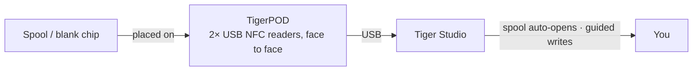

# TigerPOD

## Objectif

**Le premier « lecteur CD » pour bobines de filament intelligentes.** TigerPOD
pose un scanner de bobines sur votre bureau — et c'est vous qui l'imprimez.
Un support imprimable en 3D, gratuit et open source, qui accueille **deux**
lecteurs NFC USB **face à face** : posez une bobine, elle se présente dans Tiger
Studio ; posez une puce vierge, encodez-la. Aussi naturel que d'approcher un
téléphone, mais mains libres sur le bureau.

*On pose la bobine ; elle se présente d'elle-même.*

## Pourquoi deux lecteurs, face à face

C'est toute la raison d'être de la coque, et le point à ne pas manquer. **Nous
recommandons deux lecteurs, toujours.** Un seul lecteur fonctionne
techniquement, mais dégrade l'expérience sur deux points concrets :

- **En lecture.** Une bobine porte
 [**deux puces, sur les faces opposées**](../concepts/tigertag-chip.md). Avec un
 seul lecteur, une bobine qui se présente « dans le mauvais sens » doit être
 reprise en main et retournée avant d'être vue. Avec un lecteur de chaque côté,
 quel que soit le sens dans lequel vous posez la bobine, une puce est déjà face
 à un lecteur. Rien à retourner, rien à viser.
- **En écriture.** Quand vous taguez une bobine vous-même, vous écrivez les
 **deux** puces. Un seul lecteur, c'est deux passes, et deux occasions de les
 désaccorder. Deux lecteurs écrivent la paire **d'un coup**, et Tiger Studio
 peut les vérifier l'une par rapport à l'autre.

Le POD existe pour tenir cette géométrie : deux lecteurs, debout, face à face, à
distance de bobine. Tout le reste n'est qu'une coque autour.

## Où cela se situe

## Deux coques à imprimer — les deux gratuites

| | **TigerPOD Mini** — *recommandé* | **TigerPOD (original)** |
|---|---|---|
| |  |  |
| Impression | Plus rapide, moins de filament | Plus longue, plus de filament |
| Place sur le bureau | Moins | Plus |
| Câbles | Passés **à l'intérieur** de la coque | À l'extérieur |
| Puces | TigerTag **et** OpenSpool (NDEF) | TigerTag **et** OpenSpool (NDEF) |
| Téléchargement | **[MakerWorld — TigerPOD Mini](https://makerworld.com/fr/models/3190348-tigerpod-mini-for-openspool-tigertag-rfid-filament#profileId-3609236)** | **[MakerWorld — TigerPOD original](https://makerworld.com/fr/models/1289152-tigerpod-for-openspool-tigertag-rfid-filament#profileId-1318958)** |

Les deux accueillent les mêmes deux lecteurs de la classe ACR122U, face à face.
Le Mini est une refonte de l'original et c'est tout simplement le meilleur des
deux : commencez par lui, sauf si vous tenez au berceau plus grand.

Sous licence **CC BY 4.0** — remixez et adaptez librement.

## De quoi il est fait

Le STL, c'est la coque ; voici les pièces qui vont dedans. Rien n'est exclusif —
n'importe quel lecteur de la classe ACR122U et n'importe quel séparateur USB-C
conviennent — mais c'est la combinaison autour de laquelle la coque est dessinée :

| Pièce | Quantité | Ce que c'est |
|---|---|---|
| **TigerTag Player** | **2** | Le lecteur NFC USB — un appareil de la classe ACR122U. Un par face, pour atteindre les deux puces de la bobine en un seul passage. |
| **TigerTag Spliter** | 1 | USB-C vers 2× USB-A, pour que les deux lecteurs rejoignent l'ordinateur sur un seul port et puissent être programmés en parallèle. |
| **La coque imprimée** | 1 | **Mini** ou original — voir ci-dessus. |

### Se procurer les pièces

La coque est un téléchargement gratuit ; ce que vous achetez, ce sont les deux
lecteurs et le séparateur. Ils sont vendus en pack, ce qui reste le moyen le
moins cher d'avoir la bonne paire :

- **[Pack TigerTag Player — 2 lecteurs + Spliter](https://www.atome3d.com/products/tigertag-player-bundle-2pcs-spliter)** (Atome3D)
- Également disponible sur **[tigertag.io](https://shop.tigertag.io/collections/tigertag-rfid-maker)**

> **Note :** en assembler un soi-même ou en acheter un pré-assemblé donne
> exactement le même appareil. N'importe quels deux lecteurs de la classe
> ACR122U conviennent — le pack vous évite simplement de les chercher
> séparément.

## En construire un

1. **Imprimez une coque** — le Mini ou l'originale, ci-dessus.
2. **Procurez-vous deux lecteurs compatibles ACR122U**, dans la boutique de
 votre choix, et un lot de puces NTAG 213 / 215 / 216 vierges à écrire.
3. **Glissez un lecteur dans chaque emplacement** — sans vis, sans colle, sans
 câblage.
4. **Branchez les deux sur votre ordinateur.** Un répartiteur n'en fait qu'un
 seul câble ; deux ports USB font tout aussi bien l'affaire.
5. **Installez [Tiger Studio](./tiger-studio.md)** — il détecte les lecteurs
 tout seul.

Budget indicatif, en achetant séparément — les prix varient selon la boutique
et la région :

| Pièce | Qté | Env. | Où |
|---|---|---|---|
| Lecteur NFC compatible ACR122U | 2 | 15–25 € pièce | [Amazon](https://amzn.to/4vok3d7) · ou n'importe quelle boutique |
| Puces NTAG 213 / 215 / 216 vierges | 1 lot | 10–20 € — deux puces par bobine, un lot en équipe beaucoup | [Amazon](https://amzn.to/3TzxGc7) · [puces officielles](./tigertag.md) |
| La coque imprimée | 1 | le filament seulement | MakerWorld, ci-dessus |
| Répartiteur USB (2× USB-A femelle → 1× USB-A mâle) | 1 | 5–10 €, facultatif | [Amazon](https://amzn.to/4plgsv8) |

> Certains liens de ce tableau sont des **liens affiliés Amazon** : en tant que
> Partenaire Amazon, TigerTag est rémunéré sur les achats remplissant les
> conditions requises, **sans aucun surcoût pour vous**. Cela finance le
> protocole ouvert. Acheter les mêmes pièces ailleurs fonctionne exactement
> aussi bien.

Acheter le [kit](https://shop.tigertag.io/collections/tigertag-rfid-maker)
revient moins cher que de sourcer les mêmes pièces une à une, les lecteurs
arrivent avec le logo officiel du projet, et cela finance le standard — l'une
des façons de [soutenir le projet](../support.md). Mais en construire un avec
des pièces génériques **n'est pas une voie inférieure — c'est le même Pod**.
C'est ça, un protocole ouvert.

### Compatibilité des lecteurs

L'ACR122U parle **PC/SC**, la norme carte à puce au niveau du système que tous
les lecteurs de cette classe implémentent. Comme le Pod s'appuie sur PC/SC et
non sur un pilote propriétaire, le même montage fonctionne sous **Windows,
macOS et Linux**, et n'importe quelle bibliothèque PC/SC peut le piloter.

## Caractéristiques

- Coque imprimable en 3D — **STL gratuits sur MakerWorld**, en taille **Mini**
 et **originale**.
- Accueille deux lecteurs USB de la classe ACR122U, face à face (stations de
 lecture et d'écriture).
- Prêt à l'emploi avec [Tiger Studio](./tiger-studio.md) : scanner une puce
 ouvre automatiquement la bobine correspondante ; le flux guidé de mise à jour
 des puces s'en sert pour des écritures vérifiées par UID.
- Pas verrouillé sur TigerTag : les mêmes deux lecteurs gèrent aussi les puces
 **OpenSpool** (NDEF).

## Plus que TigerTag — une station NFC universelle

Le Pod n'est **pas verrouillé sur le protocole TigerTag**. Ce sont, très
littéralement, deux lecteurs PC/SC standard dans un support en forme de
bobine : **tout ce que sait faire un ACR122U, le Pod le fait.**

Vous contrôlez la puce entièrement — lire ce qu'elle contient, y écrire autre
chose, modifier ce qui s'y trouve, l'effacer pour la remettre à vierge. Les
quatre, et dans les deux sens. Pas d'écriture unique, pas de sens interdit, pas
de verrou constructeur. Et pour le filament, cela se passe en **Dual NFC**, les
deux puces d'une bobine traitées ensemble, sur les bobines de n'importe quelle
marque.

L'ACR122U gère bien plus que le NTAG : **ISO 14443 types A et B**, **MIFARE**
(Classic 1K/4K, Ultralight, DESFire), **FeliCa**, **Topaz/Jewel**, et les
**types de tags NFC Forum 1 à 4**. Tout ce que vous pouvez lire ou écrire avec
un ACR122U, vous pouvez le lire ou l'écrire dans le Pod — y compris les puces
[OpenSpool](../compatibility/openspool.md).

C'est aussi ce qui rend la [seconde vie](../philosophy/second-life.md) réelle.
Une TigerTag n'est jamais verrouillée en écriture : quand une bobine est
terminée, vous pouvez effacer ses puces et les réécrire en TigerTag neuves — ou
en faire tout autre chose : un simple tag **NDEF** pour la domotique, un
partage de Wi-Fi, une URL, une carte de visite. Et les retransformer en
TigerTag quand vous voulez. La puce est un actif réutilisable, pas un emballage
à usage unique.

## Interactions

| Avec | Comment |
|---|---|
| Puces TigerTag | Lecture / encodage / vérification — les deux puces d'une bobine à la fois |
| Tiger Studio | Identification instantanée de la bobine, promotion et mise à jour de la puce |

## En images

## Liens

- Dépôt : [TigerPOD](https://github.com/TigerTag-Project/TigerPOD)
- STL — **[TigerPOD Mini](https://makerworld.com/fr/models/3190348-tigerpod-mini-for-openspool-tigertag-rfid-filament#profileId-3609236)** · [TigerPOD original](https://makerworld.com/fr/models/1289152-tigerpod-for-openspool-tigertag-rfid-filament#profileId-1318958)
- Lecteurs : [Pack TigerTag Player (2 pcs + Spliter)](https://www.atome3d.com/products/tigertag-player-bundle-2pcs-spliter)

---

**◀ Précédent :** [TigerHub](./tigerhub.md) · **▲ [Index de la documentation](../../README.md)** · **Suivant ▶** [TigerScale](./tigerscale.md)

**Voir aussi :** [Le flux Seconde vie](../philosophy/second-life.md)
