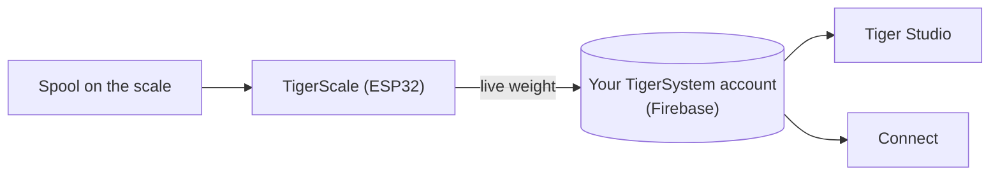

# TigerScale

## Objectif

**TigerScale répond à l'éternelle question : combien reste-t-il de filament ?**
Posez une bobine sur cette balance ESP32 open source et le poids en direct
part droit dans votre inventaire — aucune saisie manuelle, plus besoin de
secouer la bobine près de son oreille.

> **La puce sait ce que le filament *est* ; la balance sait ce qu'il en
> *reste*.** Ensemble, ils rendent l'inventaire réellement juste : l'identité
> vient de [TigerTag](./tigertag.md), la quantité en direct de TigerScale.

## TigerScale V3 — la génération actuelle

[Tiger-Scale-V3](https://github.com/TigerTag-Project/Tiger-Scale-V3), MIT.
C'est celle qu'il faut construire.

- **Elle sait quelle bobine est posée dessus** : **double lecteur NFC
 PN532**, un par face — une [bobine à deux puces](../concepts/tigertag-chip.md)
 est identifiée quel que soit le sens dans lequel vous la posez. Lire la
 puce, peser, soustraire le poids de la bobine vide, synchroniser — rien à
 taper, rien à deviner.
- **ESP32-S3** (16 Mo de flash, PSRAM), **écran tactile couleur 3,5″
 480×320** (LVGL) avec toute la configuration à l'écran : sélecteur WiFi et
 clavier, assistant de calibration, autotest matériel, mises à jour OTA.
- **Alimentée par batterie** (PMIC AXP2101, état de charge à l'écran), codec
 audio.
- Pesée de précision : HX711 + cellule de charge, filtrage médian et EMA
 adaptatif — réglé pour donner la sensation d'une balance de cuisine.
- **8 langues dans le firmware**, interface web en 9 langues.
- **Suivi du poids en direct** — les mises à jour apparaissent en temps réel
 dans Tiger Studio et Tiger NFC Connect via Firestore.
- Fonctionne avec la **calibration du poids des contenants** de Tiger Studio,
 pour que le poids net de filament reste juste selon le type de contenant.
- **Elle fonctionne hors ligne.** L'identification des marques et des matières
 vient d'une base embarquée dans la mémoire flash de l'appareil, rafraîchie au
 plus une fois par jour — la lecture d'une puce n'attend jamais le réseau.
- **La synchronisation cloud est facultative.** La balance est pleinement
 utilisable sans compte.
- **Sa propre interface web**, servie par l'appareil, adaptée au mobile, en
 direct via WebSocket à 10 Hz — aucune application à installer pour la piloter
 depuis un téléphone.
- **Aucun blob binaire** : tout se compile depuis les sources.

*Sur l'établi : on pose la bobine, elle s'identifie et se pèse.*

## En construire une

La balance est un montage DIY, et les deux étapes qu'on redoute ne sont pas
difficiles :

1. **Imprimez le boîtier.** Un seul projet Bambu Studio `.3mf` avec les
 plateaux déjà disposés — [sur MakerWorld](https://makerworld.com/en/models/3161869-tigerscale-v3-best-smart-filament-scale-with-nfc#profileId-3573543).
 Ouvrez-le dans Bambu Studio ou Orca et lancez le découpage : rien à orienter,
 aucun support à placer.
2. **Flashez depuis votre navigateur.** L'
 [installateur web](https://tigertag-project.github.io/Tiger-Scale-V3/) sert
 toujours la version courante ; ensuite la balance se met à jour toute seule,
 par OTA.

Les pièces sont courantes :

| Qté | Composant | Où |
|---|---|---|
| 1 | Carte Waveshare **ESP32-S3-Touch-LCD-3.5B** — tactile IPS 480×320 (la **-3.5** sans le B convient aussi) | [-3.5B](https://link.amazon/B0gaANfF5) · [-3.5](https://link.amazon/B0dpgOlOQ) |
| 2 | Module NFC **PN532 V3** — rangée de broches **et** interrupteur de mode indispensables | [Amazon](https://link.amazon/B0iTXrhjd) |
| 1 | Cellule de charge 5 kg + HX711 — doit avoir 2 trous taraudés M4 et 2 M5 | [Amazon](https://link.amazon/B09LOUuI1) |
| 1 | Câble USB-C 4 broches + connecteur | [câble](https://link.amazon/B0aoW8qQx) · [connecteur](https://link.amazon/B0aiEyjLx) |
| 1 | Batterie Li-ion — **facultative**, la balance fonctionne sur USB | [Amazon](https://link.amazon/B0etKlE1i) |
| — | Fils Dupont, vis autotaraudeuses M3 | [fils](https://link.amazon/B0bl6jvMs) · [vis](https://link.amazon/B0ekzxx1E) |
| — | 2× M4×30 et 2× M5×30 (cellule de charge), 4× M2×6 (écran) | n'importe quelle quincaillerie |
| 1 | Un petit haut-parleur | fourni avec la carte ESP32-S3 |

<figure>

<figcaption><strong>Les deux variantes fonctionnent, mais avec un firmware différent.</strong> Lisez la sérigraphie : <strong>-3.5B</strong> ou <strong>-3.5</strong>. L'installateur web demande laquelle vous avez ; le câblage et le boîtier sont identiques dans les deux cas.</figcaption>
</figure>
<figure>

<figcaption><strong>Attention :</strong> la cellule de charge doit avoir 2 trous taraudés M4 et 2 M5, et la carte HX711 doit être identique à celle montrée — sinon elle ne rentrera pas dans son emplacement dédié.</figcaption>
</figure>

> Certains liens de ce tableau sont des **liens affiliés Amazon** : en tant que
> Partenaire Amazon, TigerTag est rémunéré sur les achats remplissant les
> conditions requises, **sans aucun surcoût pour vous**. Cela finance le
> protocole ouvert. Acheter les mêmes pièces ailleurs fonctionne exactement
> aussi bien.

La nomenclature complète et chiffrée est dans le
[dépôt](https://github.com/TigerTag-Project/Tiger-Scale-V3).

> **Un piège à connaître.** La carte existe en **-3.5B** et en **-3.5**, et le
> firmware choisit son transport NFC à la compilation. Flashez la mauvaise
> version et vous obtenez une balance qui démarre parfaitement et ne voit
> jamais aucune puce, sans rien à l'écran pour l'expliquer. L'installateur web
> demande quelle variante vous avez — lisez la sérigraphie avant de répondre.

## À vous de la fabriquer, et de la vendre

**N'importe qui peut fabriquer et vendre du matériel TigerScale. Aucune
redevance, aucun droit de licence, aucun enregistrement.** Construisez-la,
flashez le firmware officiel, vendez-la.

La seule condition pour appeler votre produit une **TigerScale** est de faire
tourner ce firmware officiel **non modifié**, afin que chaque exemplaire se
comporte à l'identique dans l'écosystème. Vous voulez le changer ? Forkez — et
donnez un autre nom au fork. C'est tout le contrat.

## Où cela se situe

## L'histoire jusqu'ici

Trois générations, et la forme de l'objet a changé à chaque fois :

| | Lecture | Écran | Carte | Forme |
|---|---|---|---|---|
| **V1** — jamais publiée | **un seul** PN532 | mini OLED | ESP32 | un **porte-bobine** : un support central qui traverse le milieu de la bobine |
| **V2** — [Tiger-Scale](https://github.com/TigerTag-Project/Tiger-Scale), MIT | 2× RC522 | OLED 0,96″ | ESP32-WROOM, alimentée en USB | une balance plate |
| **V3** — [Tiger-Scale-V3](https://github.com/TigerTag-Project/Tiger-Scale-V3), MIT | 2× PN532 | écran tactile couleur 3,5″ | ESP32-S3, batterie | une balance plate, autonome |

La V1 embarquait déjà pour l'essentiel l'électronique de la V2 — ESP32, mini
OLED, une carte HX711 avec une cellule de charge de 5 kg — mais **un seul**
lecteur, et un corps complètement différent.

> **La V3, c'est un matériel différent, pas une mise à jour de firmware.**
> Les deux ne sont pas interchangeables : une V2 déjà construite garde son
> propre dépôt et continue de fonctionner. Elle n'est simplement plus
> développée.

Les trois sont entièrement open source (MIT) et faites de composants
courants — la preuve vivante qu'un ESP32 et un module de lecture NFC (classe
PN532 / RC522) suffisent à construire un appareil qui lit les TigerTag.

## Balances tierces — USB HID (série DYMO M et compagnie)

TigerScale est la balance maison — mais Tiger Studio lit aussi les
**périphériques USB « HID Scale »** standards (page d'usage HID `0x8D`, usage
`0x20`) : à commencer par la **DYMO M5** et le reste de la série M de DYMO
(M10, M25… même protocole), et **toute HID Scale conforme**, quelle que soit
la marque. Une option tierce, pas un produit Tiger.

Protocole, validé sur du matériel réel — des *Scale Data Reports* de 6 octets
à environ 1 Hz :

| Octet | Signification |
|---|---|
| `[0]` | identifiant de rapport `0x03` |
| `[1]` | état : 1 défaut · 2 stable à zéro · 3 en mouvement · 4 stable · 5 négatif · 6 hors capacité |
| `[2]` | unité (codes HID PoS) : `0x02` gramme · `0x0B` once · `0x0C` livre |
| `[3]` | exposant signé de puissance de dix appliqué à la valeur brute |
| `[4..5]` | poids, LE16 (LSB, MSB) |

Identifiant fabricant DYMO `0x0922` ; la M5 porte le pid `0x8009`.
Particularité : la toute première trame juste après une tare annonce
l'unité `0x00`.

> **La DYMO M2 n'est pas prise en charge** — elle n'a aucun port USB, il n'y a
> donc rien à brancher sur un ordinateur. La question du protocole ne se pose
> même pas.

## Interactions

| Avec | Comment |
|---|---|
| Firebase (base de données du compte) | Écrit le poids en direct dans le compte de l'utilisateur |
| Tiger Studio / Connect | Affichent le poids en direct ; supervision de l'état |

## Liens

- **V3 (actuelle)** : [Tiger-Scale-V3](https://github.com/TigerTag-Project/Tiger-Scale-V3) (MIT)
- La flasher depuis le navigateur : [installateur web](https://tigertag-project.github.io/Tiger-Scale-V3/)
- Imprimer le boîtier : [MakerWorld](https://makerworld.com/en/models/3161869-tigerscale-v3-best-smart-filament-scale-with-nfc#profileId-3573543)
- V2, qui n’est plus développée : [Tiger-Scale](https://github.com/TigerTag-Project/Tiger-Scale) (MIT)

---

**◀ Précédent :** [TigerPOD](./tigerpod.md) · **▲ [Index de la documentation](../../README.md)** · **Suivant ▶** [Compatibilité](../compatibility/README.md)

**Voir aussi :** [Inventaire et synchronisation cloud](../concepts/inventory-and-cloud-sync.md)
