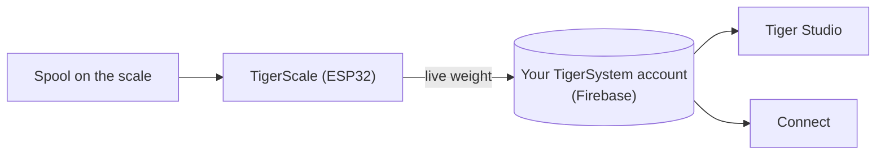

# TigerScale

## Objectif

**TigerScale répond à l'éternelle question : combien reste-t-il de filament ?**
Posez une bobine sur la balance ESP32 open source et le poids en direct part
droit dans votre inventaire — pas de saisie manuelle, pas besoin de secouer la
bobine près de votre oreille.

> **La puce sait ce qu'*est* le filament ; la balance sait combien il en
> *reste*.** Ensemble, elles rendent l'inventaire réellement juste : l'identité
> vient de [TigerTag](./tigertag.md), la quantité en direct de TigerScale.

## Où cela se situe

## Deux générations

**TigerScale V3** — la génération actuelle
([Tiger-Scale-V3](https://github.com/TigerTag-Project/Tiger-Scale-V3), MIT) :

- **Elle sait quelle bobine est posée dessus** : **deux lecteurs NFC PN532**,
 un par côté — une [bobine à double puce](../concepts/tigertag-chip.md) est
 identifiée quel que soit le sens dans lequel vous la posez. Lecture du tag,
 pesée, soustraction du poids de la bobine vide, synchronisation — sans rien
 taper, sans rien deviner.
- **ESP32-S3** (16 Mo de flash, PSRAM), **écran tactile couleur 3,5″ 480×320**
 (LVGL) avec configuration intégralement à l'écran : sélecteur WiFi + clavier,
 assistant de calibration, autotest matériel, mises à jour OTA.
- **Alimentation par batterie** (PMIC AXP2101, état de charge à l'écran), codec
 audio.
- Pesée de précision : HX711 + cellule de charge, filtrage médian + EMA
 adaptatif — réglé pour donner la sensation d'une balance de cuisine.
- **8 langues dans le firmware**, interface web en 9 langues.

**TigerScale V2** — la génération précédente
([Tiger-Scale](https://github.com/TigerTag-Project/Tiger-Scale), MIT) :
ESP32-WROOM, OLED 0,96″, 2 lecteurs RC522, alimentation USB. **La V3 est un
matériel différent, pas une mise à jour du firmware** — les deux ne sont pas
interchangeables ; ceux qui construisent une V2 continuent d'utiliser le dépôt
V2.

> **Héritage — la V1.** Une première génération a existé, mais n'a jamais été
> publiée sous forme de dépôt public. Elle embarquait pour l'essentiel
> l'électronique de la V2 — ESP32, mini OLED, une carte HX711 avec une cellule
> de charge de 5 kg — mais un **seul** lecteur PN532, dans un format totalement
> différent : une conception **porte-bobine**, avec un support central passant
> au milieu de la bobine.

## Fonctionnalités (les deux générations)

- Entièrement open source (MIT) — composants courants, la preuve vivante qu'un
 ESP32 et un module lecteur NFC (de la classe PN532 / RC522) suffisent à
 construire un appareil capable de lire un TigerTag.
- **Suivi du poids en direct** — les mises à jour apparaissent en temps réel
 dans Tiger Studio et Tiger NFC Connect via Firestore.
- Fonctionne avec la **calibration du poids des contenants** de Tiger Studio,
 pour que le poids net de filament reste juste par type de contenant.

## Balances tierces — USB HID (série DYMO M et compagnie)

TigerScale est la balance maison — mais Tiger Studio lit aussi les appareils
**USB « HID Scale » standard** (page d'usage HID `0x8D`, usage `0x20`) : à
commencer par la **DYMO M5** et le reste de la série DYMO M (M10, M25… même
protocole), et **n'importe quelle HID Scale conforme**, quelle que soit la
marque. Une option tierce, pas un produit Tiger.

Protocole, validé sur du matériel réel — *Scale Data Reports* de 6 octets à
~1 Hz :

| Octet | Signification |
|---|---|
| `[0]` | identifiant de rapport `0x03` |
| `[1]` | état : 1 défaut · 2 stable à zéro · 3 en mouvement · 4 stable · 5 négatif · 6 hors capacité |
| `[2]` | unité (codes HID PoS) : `0x02` gramme · `0x0B` once · `0x0C` livre |
| `[3]` | exposant signé de puissance de dix appliqué à la valeur brute |
| `[4..5]` | poids, LE16 (LSB, MSB) |

Identifiant fabricant DYMO `0x0922` ; la M5 porte le pid `0x8009`. Particularité :
la toute première trame juste après une tare annonce l'unité `0x00`.

## Interactions

| Avec | Comment |
|---|---|
| Firebase (base de données des comptes) | Écrit le poids en direct dans le compte de l'utilisateur |
| Tiger Studio / Connect | Affichent le poids en direct ; suivi de l'état de santé |

## Liens

- **V3 (actuelle)** : [Tiger-Scale-V3](https://github.com/TigerTag-Project/Tiger-Scale-V3) (MIT)
- V2 : [Tiger-Scale](https://github.com/TigerTag-Project/Tiger-Scale) (MIT)

---

**◀ Précédent :** [TigerPOD](./tigerpod.md) · **▲ [Index de la documentation](../../README.md)** · **Suivant ▶** [Compatibilité](../compatibility/README.md)

**Voir aussi :** [Inventaire et synchronisation cloud](../concepts/inventory-and-cloud-sync.md)
