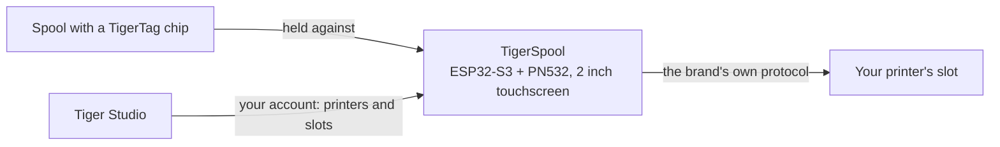

# TigerSpool

**Un petit boîtier à côté de l'imprimante. Présentez une bobine, touchez un
emplacement, et le filament y est inscrit — sur n'importe quelle marque
d'imprimante.**

Votre imprimante tient déjà une liste d'emplacements. Votre bobine porte déjà
sa propre [identité](../concepts/universal-filament-identity.md). TigerSpool,
c'est les trente centimètres entre les deux : aucune application à ouvrir,
aucun clavier, rien à ressaisir que la puce sache déjà.

Open source sous licence **MIT**, ESP32-S3, environ **40 €** de pièces
courantes.

## Ce qu'il fait

1. **Présentez la bobine au boîtier.** La
 [puce TigerTag](../concepts/tigertag-chip.md) est lue au contact.
2. **Touchez l'emplacement** voulu sur l'écran tactile — avec les noms
 d'emplacements qu'utilise l'imprimante elle-même.
3. **Confirmez.** L'affectation part vers l'imprimante via le protocole propre
 à cette marque : matière, marque, couleur et températures, au bon
 emplacement.

Il parle huit langues, demande laquelle avant toute chose, et se met à jour
tout seul par voie hertzienne.

## Où il se situe

TigerSpool n'écrit pas les puces — c'est le rôle du
[TigerPOD](./tigerpod.md), sur le bureau. TigerSpool prend une identité qui
existe déjà et la place là où l'imprimante l'attend.

## Ce qui doit exister d'abord

**C'est là que les gens se font piéger, donc ça passe avant le matériel.**

Le boîtier n'a ni clavier ni moyen de saisir l'adresse d'une imprimante,
délibérément. Il lit vos imprimantes **depuis votre compte TigerSystem**, ce
qui suppose que deux choses existent avant qu'il ne soit utile :

1. **Un compte, créé dans [Tiger Studio](./tiger-studio.md).** C'est à lui que
 le boîtier se connecte — par e-mail, ou via Google avec un QR code, de sorte
 qu'aucun mot de passe n'est jamais saisi sur un écran de deux pouces.
2. **Vos imprimantes, ajoutées dans Tiger Studio.** Adresse, code d'accès,
 marque et modèle vivent là.

Si vous sautez cette étape, la liste des imprimantes sur le boîtier est
**vide**. Ce n'est pas une panne et il n'y a rien à réparer sur l'appareil :
il vous montre exactement ce que contient votre compte. Ajoutez l'imprimante
dans Tiger Studio et elle apparaît à la synchronisation suivante.

> **En résumé :** Tiger Studio → créer un compte → ajouter vos imprimantes →
> *ensuite* configurer le boîtier.

## Quelles imprimantes

*« N'importe quelle imprimante »* est l'objectif, pas une affirmation sur
aujourd'hui. Ce qui est écrit et éprouvé sur matériel :

| Marque | Firmware | Transport |
|---|---|---|
| [Creality](../compatibility/creality.md) | implémenté, éprouvé | WebSocket |
| [FlashForge](../compatibility/flashforge.md) | implémenté, éprouvé | HTTP |
| [Bambu Lab](../compatibility/bambu-lab.md) | implémenté, éprouvé | MQTT sur TLS |
| [Snapmaker](../compatibility/snapmaker.md) | implémenté, éprouvé | Moonraker sur WebSocket |
| [Elegoo](../compatibility/elegoo.md) | non implémenté | protocole documenté, fonctionnel dans Tiger Studio |
| [Anycubic](../compatibility/anycubic.md) | non implémenté | protocole documenté, fonctionnel dans Tiger Studio |

Les noms d'emplacements suivent ceux de l'imprimante : `Ext.` et `1A`–`1D`
chez Creality et FlashForge, `A1`–`A4` puis `B1`–`B4` chez Bambu Lab,
`E1`–`E4` chez Snapmaker.

Vérifiez l'[état marque par marque](https://github.com/TigerTag-Project/TigerSpool-RFID/blob/main/docs/PRINTER-COMPATIBILITY.md)
avant d'acheter des pièces pour une machine précise.

## En construire un

Trois choses à acheter, quatre fils, une coque imprimée. **L'électronique est
identique pour toutes les marques d'imprimante** — seule la coque change, et
c'est ce qui permet de n'avoir qu'un firmware et qu'une liste de pièces.

| # | Pièce | Pourquoi celle-ci | Prix ~ |
|---|---|---|---|
| 1 | Carte de développement **Waveshare ESP32-S3-Touch-LCD-2** | Écran IPS 2,0" 240×320 tactile capacitif, ESP32-S3**R8**, 16 Mo de flash, 8 Mo de PSRAM octale. Écran, dalle tactile et MCU sur une seule carte — aucun afficheur à câbler. Les 16 Mo sont ce qui rend deux partitions OTA confortables. | ~25 € |
| 2 | Module **PN532 NFC**, V3 à interrupteurs DIP | Lit les puces NTAG21x qu'utilise TigerTag. Il doit gérer **HSU/UART** ; les deux interrupteurs vont sur `0` / OFF. Un lot de deux coûte à peine plus qu'un seul. | ~9 € les deux |
| 3 | **Un câble USB-C qui transporte les données** | Alimente et flashe la carte. Le débit n'a aucune importance — n'importe quel câble de données USB 2.0 suffit. | ~5–10 € |

Les **quatre fils de liaison sont fournis avec le PN532** — 3V3, GND, TX, RX,
et c'est tout le faisceau. Pas d'adaptateur de niveau (le PN532 fonctionne en
3V3, comme la carte), pas de batterie (le boîtier est posé à côté d'une
imprimante déjà branchée).

**Le flashage se fait depuis le navigateur** — branchez la carte, cliquez sur
Install, attendez une minute. Chrome, Edge ou Opera sur un ordinateur ; Safari
et Firefox n'implémentent pas WebSerial, et aucun navigateur mobile non plus.

**[L'installer depuis votre navigateur →](https://tigertag-project.github.io/TigerSpool-RFID/)**

### Trois pièges à connaître avant de commander

- **Le lecteur va sur GPIO43/44, jamais sur GPIO6/7.** Cette paire est un bus
 I²C avec résistances de tirage sur cette carte : un PN532 câblé là démarre,
 répond, et renvoie des UID aléatoires avec des lectures qui échouent. On
 croit à une mauvaise puce. Ce n'en est pas une, et ça coûte une journée.
- **`TXD` croise vers le RX de la carte, `RXD` vers son TX.** L'émission parle
 à la réception. Si le lecteur annonce une version de firmware à 0 au
 démarrage, inversez ces deux fils avant de toucher à quoi que ce soit
 d'autre.
- **Un câble USB de charge seule fait passer une carte saine pour morte.**
 L'écran s'allume et aucun port série n'apparaît, donc l'installateur web ne
 trouve rien à installer. Prenez un câble dont vous savez qu'il transfère des
 fichiers.

Waveshare vend plusieurs cartes semblables ; les 1,28", 1,69" et 3,5" de la
même famille ont d'autres contrôleurs de dalle et d'autres brochages, et ce
firmware n'y fonctionnera pas correctement. Vérifiez la sérigraphie, pas le
titre de l'annonce.

Liste complète des pièces, schéma de câblage et procédure de mise en route :
[TigerSpool-RFID](https://github.com/TigerTag-Project/TigerSpool-RFID).

## Où en est le projet

Écrit noir sur blanc plutôt que découvert :

- **Les coques imprimées ne sont pas encore publiées.** La règle qui les
 gouverne, elle, l'est — même carte, même lecteur, mêmes quatre fils, même
 entrée USB-C, afin qu'un seul firmware tourne sur tous les modèles et que
 n'importe qui puisse proposer une coque sans toucher au code.
- **Pas de backend Elegoo ni Anycubic.** Les deux protocoles fonctionnent dans
 Tiger Studio ; la partie firmware n'est pas écrite.
- **Le firmware n'est pas signé.** Sa connexion de mise à jour est vérifiée
 contre le magasin de certificats racines, donc le boîtier sait à qui il
 parle — mais pas qui a produit l'image.
- **Le texte à l'écran ne porte pas d'accents**, la police compilée étant de
 l'ASCII plus le degré et la puce.

---

**▲ [Index de la documentation](../../README.md)** · **Voir aussi :** [TigerPOD](./tigerpod.md), [Tiger Studio](./tiger-studio.md), [La puce TigerTag](../concepts/tigertag-chip.md), [Compatibilité imprimantes](../compatibility/README.md)
