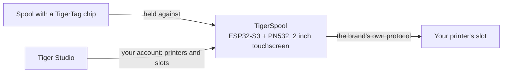

# TigerSpool

**Un petit boîtier à côté de l'imprimante. Touchez un emplacement, présentez
une bobine, et le filament y est inscrit — sur n'importe quelle marque
d'imprimante.**

*Le boîtier, une bobine, et les emplacements de l'imprimante à l'écran — chacun
montrant ce qui y est chargé. Choisissez un emplacement, approchez la bobine,
c'est fait.*

<a class="ts-cta-primary" href="https://tigertag-project.github.io/TigerSpool-RFID/">Installer depuis le navigateur</a>

<a href="https://github.com/TigerTag-Project/TigerSpool-RFID"> Les sources</a>

Votre imprimante tient déjà une liste d'emplacements. Votre bobine porte déjà
sa propre [identité](../concepts/universal-filament-identity.md). TigerSpool,
c'est les trente centimètres entre les deux : aucune application à ouvrir,
aucun clavier, rien à ressaisir que la puce sache déjà.

Open source sous licence **MIT**, ESP32-S3, environ **40 €** de pièces
courantes.

## Ce qu'il fait

1. **Touchez l'emplacement** voulu sur l'écran tactile — avec les noms
 d'emplacements qu'utilise l'imprimante elle-même.
2. **Présentez la bobine au boîtier.** La
 [puce TigerTag](../concepts/tigertag-chip.md) est lue au contact, et
 l'affectation part aussitôt vers l'imprimante via le protocole propre à
 cette marque : matière, marque, couleur et températures, au bon emplacement.
 Il n'y a rien à confirmer.
3. **Chargez la bobine.** Le boîtier vous indique dans quel emplacement.

Il parle neuf langues, demande laquelle avant toute chose, et se met à jour
tout seul par voie hertzienne.

:::caution[Avertissement]
Scanner une TigerTag sur un emplacement à l'écran ne charge rien —
cela indique seulement à l'imprimante ce qu'*est* la bobine. **Vous devez
toujours placer physiquement la bobine dans cet emplacement vous-même** — le
CFS, l'AMS, l'unité ACE, ou quel que soit le nom que cette imprimante donne
à son propre emplacement. Sautez cette étape et l'imprimante signale qu'il
n'y a pas de filament, car il n'y en a effectivement aucun de chargé.
:::

## Où il se situe

```mermaid
flowchart LR
  TAG["Spool with a TigerTag chip"] -- "held against" --> SP["TigerSpool<br/>ESP32-S3 + PN532, 2 inch touchscreen"]
  ST["Tiger Studio"] -- "your account: printers and slots" --> SP
  SP -- "the brand's own protocol" --> PR["Your printer's slot"]
```

TigerSpool n'écrit pas les puces — c'est le rôle du
[TigerPOD](./tigerpod.md), sur le bureau. TigerSpool prend une identité qui
existe déjà et la place là où l'imprimante l'attend.

## Ce qui doit exister d'abord

**C'est là que les gens se font piéger, donc ça passe avant le matériel.**

Le boîtier n'a ni clavier ni moyen de saisir l'adresse d'une imprimante,
délibérément. Il lit vos imprimantes **depuis votre compte TigerSystem**, ce
qui suppose que deux choses existent avant qu'il ne soit utile :

1. **Un compte, créé dans [Tiger Studio](./tiger-studio.md).** C'est à lui que
 le boîtier se connecte — par e-mail, ou via Google avec un QR code, de sorte
 qu'aucun mot de passe n'est jamais saisi sur un écran de deux pouces.
2. **Vos imprimantes, ajoutées dans Tiger Studio.** Adresse, code d'accès,
 marque et modèle vivent là.

Si vous sautez cette étape, la liste des imprimantes sur le boîtier est
**vide**. Ce n'est pas une panne et il n'y a rien à réparer sur l'appareil :
il vous montre exactement ce que contient votre compte. Ajoutez l'imprimante
dans Tiger Studio et elle apparaît à la synchronisation suivante.

> **En résumé :** Tiger Studio → créer un compte → ajouter vos imprimantes →
> *ensuite* configurer le boîtier.

## Quelles imprimantes

**Les six marques intégrées à Tiger Studio sont couvertes** — écrites, et
testées sur matériel. Ce n'est pas toute imprimante du marché, et *« n'importe
quelle imprimante »* reste l'objectif ; c'est toute marque à laquelle cet
écosystème parle aujourd'hui :

| Marque | Firmware | Transport |
|---|---|---|
| [Creality](../compatibility/creality.md) | implémenté, éprouvé | WebSocket |
| [FlashForge](../compatibility/flashforge.md) | implémenté, éprouvé | HTTP |
| [Bambu Lab](../compatibility/bambu-lab.md) | implémenté, éprouvé | MQTT sur TLS |
| [Snapmaker](../compatibility/snapmaker.md) | implémenté, éprouvé | Moonraker sur WebSocket |
| [Elegoo](../compatibility/elegoo.md) | implémenté, lecture éprouvée — écriture pas encore confirmée sur une imprimante | MQTT |
| [Anycubic](../compatibility/anycubic.md) | implémenté, lecture éprouvée — écriture pas encore confirmée ; mode LAN uniquement | MQTT sur TLS |

Les noms d'emplacements suivent ceux de l'imprimante : `Ext.` et `1A`–`1D`
chez Creality et FlashForge, `A1`–`A4` puis `B1`–`B4` chez Bambu Lab,
`E1`–`E4` chez Snapmaker, `S1`–`S4` sur le Canvas d'Elegoo, et une lettre par
unité ACE chez Anycubic — `A1`, `A2`… puis `B1`… pour un second boîtier.

Vérifiez l'[état marque par marque](https://github.com/TigerTag-Project/TigerSpool-RFID/blob/main/docs/PRINTER-COMPATIBILITY.md)
avant d'acheter des pièces pour une machine précise.

## En construire un

Trois choses à acheter, quatre fils, une coque imprimée — plus deux extras à
considérer. **L'électronique est identique pour toutes les marques
d'imprimante** — seule la coque change, et c'est ce qui permet de n'avoir qu'un
firmware et qu'une liste de pièces.

| Qté | Composant | Où |
|---|---|---|
| 1 | Carte de développement Waveshare **ESP32-S3-Touch-LCD-2** — écran IPS 2,0" 240×320 tactile capacitif, ESP32-S3**R8**, 16 Mo de flash, 8 Mo de PSRAM octale. Écran, dalle tactile et MCU sur une seule carte, et les 16 Mo rendent deux partitions OTA confortables | [Amazon](https://link.amazon/B0c5hr3uf) |
| 1 | Module NFC **PN532 V3** — interrupteurs DIP, doit gérer **HSU/UART**, les deux sur `0` / OFF. Un lot de deux coûte à peine plus qu'un seul | [Amazon](https://link.amazon/B0dyEfwKa) |
| 1 | Un câble USB-C **qui transporte les données** — le débit n'a aucune importance, n'importe quel câble USB 2.0 de données suffit | [Amazon](https://link.amazon/B00Xg3WT4) |
| 1 | Connecteur USB-C magnétique — **recommandé** : le port est la pièce manipulée tous les jours, et c'est le câble qui lâche plutôt que la prise | [Amazon](https://link.amazon/B0bWVIBa0) |
| 1 | Accu LiPo 3,7 V 1000 mAh, PH1.25 — **optionnel**, chargé par l'USB ; le boîtier fonctionne alors sans câble. La carte ne sait pas détecter un accu : vous le déclarez dans Réglages › Batterie. Vérifiez la polarité | [Amazon](https://link.amazon/B0fL0jjf3) |

> Certains liens de ce tableau sont des **liens affiliés Amazon** : en tant que
> partenaire Amazon, TigerTag perçoit une commission sur les achats
> correspondants, **sans surcoût pour vous**. Cela aide à financer le protocole
> ouvert. Acheter les mêmes pièces ailleurs fonctionne exactement pareil.

Les **quatre fils de liaison sont fournis avec le PN532** — 3V3, GND, TX, RX,
et c'est tout le faisceau. Pas d'adaptateur de niveau : le PN532 fonctionne en
3V3, comme la carte. La batterie est **optionnelle** — le boîtier est
normalement posé à côté d'une imprimante déjà branchée, et l'accu ci-dessus est
pour les fois où il ne l'est pas.

*Tout le faisceau. Sur le PN532, les deux broches de données sont sérigraphiées
`SDA` et `SCL` — en mode HSU, ce sont elles qui portent l'UART : le **TX de la
carte va sur `SCL`**, son **RX sur `SDA`**, et les deux interrupteurs DIP sont
sur `0` / OFF. L'accu optionnel se branche directement sur le connecteur
**BAT** de la carte, rien d'autre à câbler.
[Schéma interactif](https://app.cirkitdesigner.com/project/7a6c0887-8e44-4303-81b3-be51aab4b40a).*

**Le flashage se fait depuis le navigateur** — branchez la carte, cliquez sur
Install, attendez une minute. Chrome, Edge ou Opera sur un ordinateur ; Safari
et Firefox n'implémentent pas WebSerial, et aucun navigateur mobile non plus.

**[L'installer depuis votre navigateur →](https://tigertag-project.github.io/TigerSpool-RFID/)**

### Trois pièges à connaître avant de commander

- **Le lecteur va sur GPIO43/44, jamais sur GPIO6/7.** Cette paire est un bus
 I²C avec résistances de tirage sur cette carte : un PN532 câblé là démarre,
 répond, et renvoie des UID aléatoires avec des lectures qui échouent. On
 croit à une mauvaise puce. Ce n'en est pas une, et ça coûte une journée.
- **`TXD` croise vers le RX de la carte, `RXD` vers son TX.** L'émission parle
 à la réception. Si le lecteur annonce une version de firmware à 0 au
 démarrage, inversez ces deux fils avant de toucher à quoi que ce soit
 d'autre.
- **Un câble USB de charge seule fait passer une carte saine pour morte.**
 L'écran s'allume et aucun port série n'apparaît, donc l'installateur web ne
 trouve rien à installer. Prenez un câble dont vous savez qu'il transfère des
 fichiers.

Waveshare vend plusieurs cartes semblables ; les 1,28", 1,69" et 3,5" de la
même famille ont d'autres contrôleurs de dalle et d'autres brochages, et ce
firmware n'y fonctionnera pas correctement. Vérifiez la sérigraphie, pas le
titre de l'annonce.

Liste complète des pièces, schéma de câblage et procédure de mise en route :
[TigerSpool-RFID](https://github.com/TigerTag-Project/TigerSpool-RFID).

## Où en est le projet

Écrit noir sur blanc plutôt que découvert :

- **La première coque imprimée est publiée** : un support de bureau
 autoportant, bobine à gauche ou à droite, dans
 [Model3D/](https://github.com/TigerTag-Project/TigerSpool-RFID/tree/main/Model3D).
 Les coques qui se fixent sur une imprimante donnée suivent la même règle —
 même carte, même lecteur, mêmes quatre fils, même entrée USB-C — afin qu'un
 seul firmware tourne sur tous les modèles et que n'importe qui puisse en
 proposer une sans toucher au code.
- **Le firmware n'est pas signé.** Sa connexion de mise à jour est vérifiée
 contre le magasin de certificats racines, donc le boîtier sait à qui il
 parle — mais pas qui a produit l'image.
- **Dix imprimantes connectées en même temps, au plus** — sur les 24 qu'un
 compte peut lui confier — dont trois au plus qui parlent TLS (Bambu Lab,
 Anycubic), les plus gourmandes en mémoire.

---

**▲ [Index de la documentation](../../README.md)** · **Voir aussi :** [TigerPOD](./tigerpod.md), [Tiger Studio](./tiger-studio.md), [La puce TigerTag](../concepts/tigertag-chip.md), [Compatibilité imprimantes](../compatibility/README.md)
