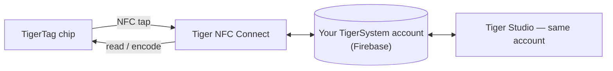

# Tiger NFC Connect (application mobile)

## Objectif

**Votre téléphone est déjà un lecteur TigerTag — Connect ne fait que
l'allumer.** L'application iOS/Android lit n'importe quelle bobine d'un simple
contact, encode les puces tout aussi facilement, et garde toute votre
collection dans votre poche. C'est le point d'entrée quotidien de l'écosystème
et l'incarnation du
[pont smartphone](../philosophy/smartphone-bridge.md).

<strong>iPhone · iPad</strong>
<a class="ts-cta-primary" href="https://apps.apple.com/app/id6745437963">App Store</a>
Scannez avec l'appareil photo, ou touchez le bouton

<strong>Android</strong>
<a class="ts-cta-primary" href="https://play.google.com/store/apps/details?id=com.tigertag.connect">Google Play</a>
Scannez avec l'appareil photo, ou touchez le bouton

<a href="https://tigersystem.io/download">Tous les téléchargements sur tigersystem.io</a>
<a href="https://testflight.apple.com/join/jVHhmK4C">Bêta TestFlight (iOS)</a>
<a href="https://play.google.com/apps/testing/com.tigertag.connect">Bêta Google Play</a>

Gratuite, sur les deux boutiques. L'application lit une puce avec le NFC du
téléphone lui-même — rien à acheter, aucun lecteur, aucun compte pour lire.

## Où cela se situe

## Fonctionnalités

- **Lecture NFC en mobilité** — approchez le téléphone d'une bobine, son
 profil complet s'affiche.
- **Programmation des puces** — encodez et réencodez les puces TigerTag depuis
 le téléphone.
- **Consultation du catalogue** — la base de données de référence partagée
 marques / matières / couleurs.
- **Compte partagé** — le même backend Firebase que Tiger Studio : inventaire,
 amis et racks restent synchronisés en temps réel sur tous les appareils.
- **Accessoires USB-C** — prise en charge de l'analyseur de filament AJAX-3D
 **TD-1 / TD1s** en USB-C : mesurez la Transmission Distance d'un filament
 (et sa couleur) directement depuis le téléphone
 ([matériel tiers compatible](../compatibility/third-party-hardware.md)).

## Se la procurer

- **Publiée** sur l'**App Store (iOS)** et **Google Play (Android)** — en
 version 1.0.2 aujourd'hui.
- Des **bêtas publiques** sont également disponibles (TestFlight sur iOS,
 bêta ouverte sur Android).
- Tous les liens de téléchargement : **[tigersystem.io/download](https://tigersystem.io/download)**
 — un QR code est également toujours disponible dans la barre latérale de
 Tiger Studio.

> **Note sur le nom :** publiée autrefois sous le nom *« TigerTag RFID
> Connect »* — renommée **Tiger NFC Connect** pour faire écho au lecteur NFC
> déjà présent dans chaque téléphone.
> L'application est **gratuite mais propriétaire** (pas open source) pour
> l'instant — contrairement à Tiger Studio, aux SDK et au matériel, qui sont
> ouverts.

## Architecture

Application Flutter dialoguant avec Firebase (Auth + Firestore) — l'unique
base de comptes partagée derrière toutes les applications. Sur mobile, la
connectivité imprimante passe par le cloud lorsque les constructeurs
l'autorisent.

## Interactions

| Avec | Comment |
|---|---|
| Puces TigerTag | Lecture et écriture par contact NFC |
| Firebase (base de comptes) | Synchronisation temps réel inventaire / amis / préférences |
| Tiger Studio | Compagnon de bureau — même compte, fonctions complémentaires |

## En images

|| | | |
|---|---|---|---|
|  |  |  |  |

---

**◀ Précédent :** [TigerTag+](./tigertag-plus.md) · **▲ [Index de la documentation](../../README.md)** · **Suivant ▶** [Tiger Studio](./tiger-studio.md)

**Voir aussi :** [Pont smartphone](../philosophy/smartphone-bridge.md), [Inventaire et synchronisation cloud](../concepts/inventory-and-cloud-sync.md)
