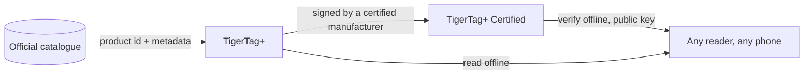

# TigerTag+ Certified

## Objectif

**Certified, c'est le palier capable de prouver d'où vient une puce.** Un
[TigerTag+](./tigertag-plus.md) qui porte en plus une **signature
cryptographique** est un **TigerTag+ Certified**. La signature est écrite par
un fabricant titulaire de la [certification TigerTag+](../developers/README.md),
à qui les outils de signature sont remis dans ce cadre ; TigerTag détient la
clé privée.

C'est le seul des trois paliers qui ne soit pas ouvert à tous, et le seul qui
réponde à une question que les deux autres ne peuvent pas trancher : *cette
bobine est-elle authentique ?*

## Les trois paliers, côte à côte

| | TigerTag | TigerTag+ | TigerTag+ Certified |
|---|---|---|---|
| Données d'impression, **sur la puce** | oui | oui | oui |
| Fonctionne entièrement hors ligne | oui | oui | oui |
| Identifiant produit du catalogue, **sur la puce** | — | **oui** | oui |
| Métadonnées d'enrichissement, **côté cloud, optionnel** | — | **oui** | oui |
| Signature d'origine, **sur la puce** | — | — | **oui** |
| Qui peut en produire un | n'importe qui | quiconque écrit un produit du catalogue | **un fabricant certifié uniquement** |

Lisez attentivement la colonne de gauche : les métadonnées d'enrichissement
sont la seule ligne qui ne vit **pas** sur la puce. Elles sont consultées dans
le catalogue quand il se trouve que vous êtes en ligne, et elles peuvent
s'améliorer après l'écriture de la puce — ce qui est précisément pourquoi elles
ne peuvent jamais être quelque chose dont la puce a besoin. Tout ce dont
l'imprimante a besoin figure dans les lignes marquées *sur la puce*, et c'est
ce qui garde les trois paliers 100 % hors ligne.

## Vérifier est gratuit — émettre, voilà ce qu'accorde la certification

**Vérifier** une signature est gratuit, hors ligne et sans restriction : les
clés publiques sont publiées, et n'importe quel lecteur peut en vérifier une
sans compte ni réseau. **En émettre** une, voilà ce qu'accorde la
certification.

Le message signé couvre délibérément l'**UID propre** de la puce : une charge
signée recopiée sur une autre puce ne lui correspond plus, et une étiquette
clonée échoue à la vérification, sur le téléphone même du client. C'est la même
propriété qui fait que les deux puces d'une bobine portent deux signatures
*différentes* ([comment les deux puces sont liées](../concepts/tigertag-chip.md)).

## Où cela se situe

La disposition au niveau de l'octet — identifiants de type de puce, zone de
signature de 64 octets aux pages `0x18`–`0x27` — est spécifiée dans
[TigerTag-RFID-Guide](https://github.com/TigerTag-Project/TigerTag-RFID-Guide).

## Qui est certifié

La liste faisant foi des fabricants autorisés à apposer la marque sur un
produit est le [registre des partenaires certifiés](../certified-partners.md).
Un logo sur une puce, un carrier, une bobine ou son emballage n'est autorisé
que pour les fabricants figurant sur cette page.

---

**◀ Précédent :** [TigerTag+](./tigertag-plus.md) · **▲ [Index de la documentation](../../README.md)** · **Suivant ▶** [Tiger NFC Connect](./tigertag-connect.md)

**Voir aussi :** [La puce TigerTag](../concepts/tigertag-chip.md), [Partenaires certifiés](../certified-partners.md), [Documentation développeur](../developers/README.md)
