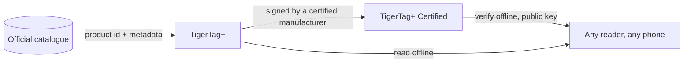

# TigerTag+

## Objectif

**Le `+` veut dire identifié.** Un TigerTag+ est un TigerTag dont l'identité
porte un **identifiant produit issu du catalogue officiel** — non pas des
valeurs saisies par quelqu'un, mais le produit exact : marque, couleur,
matériau, températures, diamètre, SKU, EAN, directement à la source. En plus de
cela, il peut porter des **métadonnées d'enrichissement optionnelles**,
conservées côté cloud et améliorables après l'écriture de la puce.

La puce elle-même reste **100 % hors ligne**. Tout ce qu'il faut pour imprimer
s'y trouve, exactement comme sur un TigerTag standard — l'identifiant de
catalogue ajoute la possibilité de consulter des données plus riches et plus
fraîches *quand il se trouve que vous êtes en ligne*, et n'enlève rien quand
vous ne l'êtes pas. Un TigerTag+ lu en mode avion se comporte comme n'importe
quel autre TigerTag.

C'est le même `+` que dans [TigerData+](../concepts/universal-filament-identity.md) :
dans les deux cas, il veut dire *cette identité est un vrai produit du
catalogue*, et dans aucun des deux il ne veut dire *certifié*.

> **Note de nommage :** anciennement vendu sous le nom de **« TigerTag Pro »** —
> le nom est désormais **TigerTag+**.

## TigerTag+ Certified — la variante signée

Un TigerTag+ qui porte en plus une **signature cryptographique** est un
**TigerTag+ Certified**. La signature est écrite par un fabricant titulaire de
la [certification TigerTag+](../developers/README.md), à qui les outils de
signature sont remis dans ce cadre ; TigerTag détient la clé privée.

| | TigerTag | TigerTag+ | TigerTag+ Certified |
|---|---|---|---|
| Données d'impression, **sur la puce** | oui | oui | oui |
| Fonctionne entièrement hors ligne | oui | oui | oui |
| Identifiant produit du catalogue, **sur la puce** | — | **oui** | oui |
| Métadonnées d'enrichissement, **côté cloud, optionnel** | — | **oui** | oui |
| Signature d'origine, **sur la puce** | — | — | **oui** |
| Qui peut en produire un | n'importe qui | quiconque écrit un produit du catalogue | **un fabricant certifié uniquement** |

Lisez attentivement la colonne de gauche : les métadonnées d'enrichissement
sont la seule ligne qui ne vit **pas** sur la puce. Elles sont consultées dans
le catalogue quand il se trouve que vous êtes en ligne, et elles peuvent
s'améliorer après l'écriture de la puce — ce qui est précisément pourquoi elles
ne peuvent jamais être quelque chose dont la puce a besoin. Tout ce dont
l'imprimante a besoin figure dans les lignes marquées *sur la puce*, et c'est
ce qui garde les trois paliers 100 % hors ligne.

**Vérifier** une signature est gratuit, hors ligne et sans restriction — les
clés publiques sont publiées, et n'importe quel lecteur peut en vérifier une
sans compte ni réseau. **En émettre** une, voilà ce qu'accorde la
certification. Le message signé couvre délibérément l'**UID propre** de la
puce : une charge signée recopiée sur une autre puce ne lui correspond plus, et
une étiquette clonée échoue à la vérification, sur le téléphone même du client.
C'est la même propriété qui fait que les deux puces d'une bobine portent deux
signatures *différentes* ([comment les deux puces sont liées](../concepts/tigertag-chip.md)).

La disposition au niveau de l'octet — identifiants de type de puce, zone de
signature de 64 octets aux pages `0x18`–`0x27` — est spécifiée dans
[TigerTag-RFID-Guide](https://github.com/TigerTag-Project/TigerTag-RFID-Guide).

## Où cela se situe

## Sauvegarder une puce — une fonctionnalité distincte

Tiger Studio peut **sauvegarder le contenu exact d'une puce** dans votre
compte, indexé sur son UID physique, et plus tard la reprogrammer dans cet
état. C'est utile et sans rapport avec le `+` : cela s'applique à toute puce
que vous pouvez scanner, et avoir une sauvegarde ne fait pas d'une puce un
TigerTag+.

- **Restauration de l'état d'usine** : si une puce est réécrite ou corrompue
 par accident, remettez-la exactement dans l'état où elle était — signature
 comprise, si elle en avait une.
- **La même puce uniquement** : la restauration n'est valable que sur la puce
 d'origine, car la sauvegarde est liée à son UID. Une protection pour *cette*
 puce, jamais un moyen de cloner.
- **Preuve de possession** : un scan qui correspond à la sauvegarde montre que
 la puce d'origine est physiquement entre vos mains.

> **Note :** créer une sauvegarde nécessite actuellement **Tiger Studio + un
> lecteur USB (TigerPOD / ACR122U)** ; la prise en charge mobile est prévue.

## Interactions

| Avec | Comment |
|---|---|
| Tiger Studio + TigerPOD/ACR122U | Lit et vérifie les signatures ; crée et restaure les sauvegardes de puces |
| Tiger NFC Connect | Lit et vérifie ; prise en charge de la sauvegarde à venir |
| SDK | `tigertag[verify]` vérifie une signature hors ligne, en Python ou en JS |
| Firebase (base de données des comptes) | Contient le catalogue, les métadonnées d'enrichissement et les sauvegardes de puces par compte |

## Liens

- Puces officielles : **[tigertag.io](https://tigertag.io)** (boutique)

---

**◀ Précédent :** [TigerTag](./tigertag.md) · **▲ [Index de la documentation](../../README.md)** · **Suivant ▶** [Tiger NFC Connect](./tigertag-connect.md)

**Voir aussi :** [Identité universelle du filament](../concepts/universal-filament-identity.md), [La puce TigerTag](../concepts/tigertag-chip.md), [Documentation développeur](../developers/README.md)
