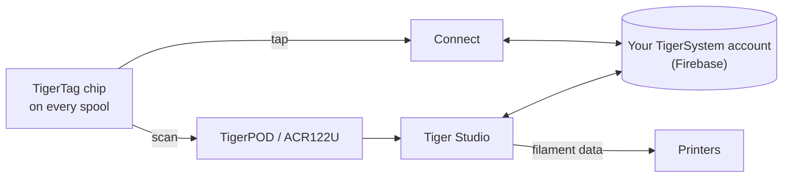

# TigerTag

## Objectif

**TigerTag donne à chaque bobine une mémoire qui lui est propre.** Une petite
puce NFC contient tout ce qui concerne le filament — marque, matière, couleur,
conditions d'impression — pour que vous n'ayez plus jamais à deviner,
étiqueter ou mémoriser. Approchez votre téléphone et la bobine se présente
elle-même.

Techniquement, c'est le cœur de l'écosystème : un standard RFID ouvert,
lisible par n'importe quelle application ou n'importe quel lecteur compatible
— sans verrouillage constructeur, sans format secret.

## Où cela se situe

## Caractéristiques

- Puce standard **NTAG213 / 215 / 216** (ronde de 25 mm recommandée), charge
 utile NDEF ouverte de 144 octets — dimensionnée pour tenir dans la plus
 petite, la NTAG213 ; ni clés, ni verrouillage propriétaire.
- **Deux puces par bobine, sur les faces opposées** — l'une fait toujours face
 au lecteur (emplacement d'imprimante, AMS, téléphone en main) et chacune sert
 de sauvegarde à l'autre
 ([pourquoi](../concepts/tigertag-chip.md)).
- Identité résolue via la [base de données de référence](../concepts/universal-filament-identity.md) partagée.
- Inscriptible et **réinscriptible** — c'est ce qui rend possible le [flux Seconde vie](../philosophy/second-life.md) ;
 les puces officielles de marque sont livrées en NTAG215 pour que la puce
 elle-même puisse être réutilisée comme simple objet NDEF (porte-clés, carte
 de visite…) une fois la bobine vide — jamais de déchet électronique.
- Lisible par n'importe quel smartphone NFC, les lecteurs ACR122U et
 [TigerPOD](./tigerpod.md).
- Une **zone réservée de 64 octets** (pages `0x18`–`0x27`, laissant 80 octets de
 données) : libre pour les **fonctions additionnelles de la communauté** sur un
 TigerTag standard ; elle porte la signature d'origine — 32 octets de `R`, 32 de
 `S` — sur un [TigerTag+](./tigertag-plus.md).

## Architecture

Voir [La puce TigerTag](../concepts/tigertag-chip.md) pour le résumé du format et
[TigerTag-RFID-Guide](https://github.com/TigerTag-Project/TigerTag-RFID-Guide)
pour la spécification canonique au niveau de l'octet.

## Interactions

| Avec | Comment |
|---|---|
| Tiger NFC Connect | Contact NFC : lecture, encodage |
| Tiger Studio | Le scan du lecteur ouvre automatiquement la bobine ; mise à jour guidée de la puce |
| SDK | Analyser / vérifier / encoder depuis JS ou Python |
| Imprimantes | Indirectement — via le [pont smartphone](../philosophy/smartphone-bridge.md) et les liaisons imprimante de Studio |

## En images

> **Note sur le nom :** les puces standard étaient autrefois vendues sous le nom
> de **« TigerTag Maker »** — le nom est désormais simplement **TigerTag**.

## Les puces officielles, et celles de tout le monde

**TigerSystem fabrique les puces officielles** et y appose le logo TigerTag.
Elles existent en deux formats, et les deux sont livrées **vierges** :

| Format | Pour |
|---|---|
| **Sticker** | une bobine que vous possédez déjà — une sur chaque face ([pourquoi deux](../concepts/tigertag-chip.md)) |
| **Carrier refill** | les [refills](../philosophy/second-life.md) sans bobine : collé à l'intérieur du carton central avant montage sur une masterspool réutilisable, la puce voyage donc avec le filament et non avec la bobine |

Qui a le droit de dire quoi, lorsqu'une puce est mise en vente :

| Qui | Ce qu'il vend | Peut l'appeler | Logo |
|---|---|---|---|
| **TigerSystem** | les puces qu'il fabrique | **officiel** — c'est nous | oui — c'est lui qui appose la marque |
| **Tout revendeur ou distributeur** | ces mêmes puces authentiques | **officiel** — la marchandise l'est | oui — la marque est déjà dessus |
| **Un tiers validé par TigerSystem** | ses propres puces, inlays ou carriers | **certifié** — accordé, audité, référencé | oui, sur le produit |
| **Quiconque fabrique sa propre puce** | sa propre puce compatible | *« compatible with TigerTag »* — et avec **TigerTag+** s'il vérifie les signatures. Jamais *« certified »*, que seul TigerSystem accorde | dans son application, sa documentation et sa fiche produit — **jamais sur la puce, le carrier, la bobine ou l'emballage** |

Cette dernière distinction constitue toute la politique de marque, et elle est
plus étroite qu'il n'y paraît. Dire que votre produit *dialogue avec* TigerTag
est un fait sur votre produit, et montrer le logo pour le dire est libre.
Apposer la marque **sur** une puce est une affirmation sur **qui l'a
fabriquée** : elle cesse de signifier « ceci fonctionne avec TigerTag » pour
signifier « ceci *est* un TigerTag ». Seul ce second usage demande une
autorisation écrite. Voir [TRADEMARK.md](../../TRADEMARK.md).

Plus de **2,5 millions de puces TigerTag** ont été produites — la plupart
intégrées en usine par des marques de filament (Rosa3D, eSun, Sunlu, Landu,
Jamg He, R3D — Filforme, Nanovia et d'autres étant en cours d'intégration).
Mais le protocole n'est délibérément **pas lié aux puces officielles** :
n'importe quelle puce NTAG vierge et bon marché achetée n'importe où (Amazon,
AliExpress, en boutique) fonctionne à l'identique, et rien ne l'en empêche.
Les puces de marque aident à financer la R&D ; l'adoption du protocole est la
première récompense.

La liberté vaut dans les deux sens : **les puces ne sont jamais verrouillées en
écriture**. TigerTag est simplement le protocole de base avec lequel les usines
de filament livrent leurs bobines — si vous préférez un autre protocole
NFC/RFID (propre ou existant), vous pouvez réécrire la puce et y migrer ses
données. Votre bobine, votre puce, votre format.

## Liens

- Puces officielles : **[tigertag.io](https://tigertag.io)** (boutique — soutient la R&D)
- Format de la puce : [TigerTag-RFID-Guide](https://github.com/TigerTag-Project/TigerTag-RFID-Guide)

---

**◀ Précédent :** [Produits](./README.md) · **▲ [Index de la documentation](../../README.md)** · **Suivant ▶** [TigerTag+](./tigertag-plus.md)

**Voir aussi :** [Identité universelle du filament](../concepts/universal-filament-identity.md), [Seconde vie](../philosophy/second-life.md)
