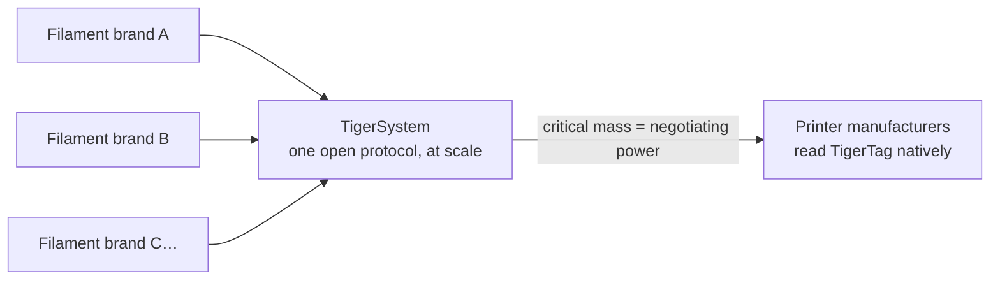

# Pour les fabricants de filament

> **Rendez vos bobines intelligentes et connectées.**

## La bobine intelligente est en marche — la seule voie ouverte est ici

Les imprimantes attendent de plus en plus un filament intelligent : systèmes
de classe AMS, détection du matériau emplacement par emplacement, réglages
automatiques. Chaque fabricant d'imprimante y répond par un **tag fermé,
verrouillé sur ses machines, qui alimente son cloud** — zéro
interopérabilité, zéro valeur pour votre marque hors de ses murs. Et chaque
tag verrouillé remplit une seconde fonction : **orienter vos clients vers le
filament du fabricant d'imprimante**. TigerTag a été créé en 2023 précisément
pour que les marques tierces disposent d'une meilleure réponse — des bobines
plus intelligentes que les propriétaires, sans le jardin clos.

**TigerTag est le protocole RFID tiers le plus déployé au monde** — et, à ce
jour, la seule solution ouverte de bobine intelligente réellement viable et
diffusée à grande échelle : un protocole ouvert, standard, agnostique et
multiplateforme, avec plus de **2,5 millions de puces déjà produites** et
intégrées en usine par des marques comme Rosa3D, eSun, Sunlu, Landu, Jamg He
et R3D — Filforme et Nanovia étant en cours d'intégration.

## Intégration en usine : des jours, pas des mois

Nous avons l'expérience et la technologie pour faire entrer les puces TigerTag
dans votre ligne de production **rapidement, simplement et pour un coût très
faible — opérationnel en 5 jours seulement**, avec une écriture **d'environ
1 seconde par puce** (des milliers de bobines par jour, en un clic) :

- Matériel NTAG standard (aucun composant propriétaire, aucun verrouillage
 d'outillage), sourcé à une échelle et à un coût choisis pour un objectif non
 négociable : **ajouter la technologie sans ajouter un centime au prix
 final de la bobine.**
- Une méthode d'intégration éprouvée, déjà déployée dans plusieurs usines,
 portée par la suite industrielle
 [TigerTag Factory & Manager](../products/factory-suite.md) : votre base de
 données filament d'un côté, l'écriture de masse à la cadence de la ligne
 dans chaque bobine de l'autre — avec la **signature d'usine qui prouve
 l'origine de chaque produit**.
- La base de données de référence partagée donne à vos produits une identité
 précise et universelle, que toutes les applications compatibles résolvent à
 l'identique.

Les marques qui livrent des TigerTags dans leurs produits peuvent arborer la
marque **TigerTag Certified** — un signal visible pour le client : cette
bobine est intelligente et ouverte.

> Écrivez-nous à **[tigertag@tigertag.io](mailto:tigertag@tigertag.io)** (ou
> via l'[organisation GitHub](https://github.com/TigerTag-Project)) pour
> entamer la discussion.

## Merci aux intégrateurs

Les marques ci-dessous ont rendu la bobine ouverte réelle — chacune à son
niveau d'engagement, et toutes méritent d'être citées. Les paliers forment une
**échelle** : plus une marque s'engage loin, plus elle apparaît en évidence —
ici comme sur toutes les surfaces de l'écosystème. Les meilleurs se voient de
plus loin.

### Platine — le sommet

**TigerTag+ sur l'intégralité de la production** : tous les formats de bobine,
des puces signées en standard sur chaque bobine qui sort de l'usine. Rien
d'optionnel, rien de partiel — l'expérience complète de la bobine ouverte,
pour chaque client, par défaut. Les intégrateurs Platine sont **mis en avant
partout** : cités en premier, logo le plus grand, leur histoire racontée.

**[Rosa3D](https://rosa3d.pl)** — le **premier intégrateur au monde** à
déployer TigerTag+ sur toute sa production. La référence que tous les autres
cherchent à rattraper.

### Or — engagés, à grande échelle

**Intégration à la demande au moment de la production**, avec de grandes
quantités déjà produites, un niveau d'intégration élevé et un **engagement
public officiel**. À une marche du sommet : généraliser les puces signées à
toute la ligne, et rejoindre le Platine.

&nbsp;&nbsp;&nbsp;&nbsp;

**[R3D](https://r3dprint.com)** · **[eSun](https://www.esun3d.com)**

### Argent — embarqués

**La technologie intégrée à la demande** — le premier pas, et il est déjà bien
réel : leurs clients peuvent acheter des bobines équipées de TigerTag dès
aujourd'hui. Le barreau suivant, c'est l'Or : monter les volumes et rendre
l'engagement public.

&nbsp;&nbsp;&nbsp;&nbsp;&nbsp;&nbsp;&nbsp;&nbsp;

**[Sunlu](https://www.sunlu.com)** · **[Landu](https://www.landustore.com)** · **[Jamg He](https://www.jamghe.com)**

…et d'autres en cours d'intégration —
[Filforme](https://www.filforme.com), [Nanovia](https://nanovia.tech), et
d'autres encore à venir.

**Vous voulez votre logo sur cette échelle — et en plus grand ?** Une ligne de
production tourne sous TigerTag en 5 jours seulement :
[tigertag@tigertag.io](mailto:tigertag@tigertag.io).

## Ils l'ont annoncé eux-mêmes

Publications publiques sur les canaux des marques elles-mêmes — pas notre
communiqué de presse (sources et annonces complètes :
[tigersystem.io/en/manufacturers](https://tigersystem.io/en/manufacturers)).
**Cliquez sur une image pour ouvrir la publication d'origine :**

|| | |
|---|---|---|
|  |  |  |

> **ROSA 3D FILAMENTS** — *« a officiellement intégré le protocole RFID
> ouvert TigerTag sur 100 % de sa production de filament. »* Plus de 250 000
> bobines déjà produites avec TigerTag.
> ([publication d'origine](https://www.instagram.com/p/DVyeOZajZSm/))

> **R3D Filament** — *« a officiellement lancé le déploiement à grande échelle
> du protocole RFID ouvert TigerTag sur sa production de filament en
> Europe. »*
> ([publication d'origine](https://www.instagram.com/reel/DVoAMqTk5ck/))

> **eSUN** — *« a officiellement intégré la technologie RFID TigerTag ! »* —
> en pilote sur le marché français, en cours d'extension à toute l'Europe.
> ([publication d'origine](https://www.instagram.com/p/DUjydNXkc1W/))

## Comment les tags arrivent dans vos bobines

<table>
<tr>
<td align="center" width="55%">
<strong>Face avant</strong> 
 
<strong>Face arrière</strong> 

</td>
<td align="center">

</td>
</tr>
</table>

*Face avant — les deux puces marquées, avec l'adhésif industriel 3M
(468MP / 200MP) au milieu. Face arrière — les deux antennes NFC
indépendantes, une à chaque extrémité. Monté sur la recharge : une puce par
côté, votre opérateur décolle et colle — rien d'autre ne change sur la ligne.*

## Déjà en rayon

|| | |
|---|---|---|
|  |  |  |

*Rosa3D, eSun, Sunlu — de vraies boîtes, commercialisées avec TigerTag à
l'intérieur.*

|| | | |
|---|---|---|---|
|  |  |  |  |

*Le filament lui-même : Rosa3D, eSUN, Sunlu, R3D — chacun d'eux est
commercialisé avec des puces TigerTag sur la bobine.*

## Ce que vos clients obtiennent dès le premier jour

Une bobine qui s'identifie auprès de **n'importe quel téléphone NFC**, un
écosystème d'inventaire complet (mobile, bureau, web), une intégration en
direct avec six marques d'imprimantes, le suivi du poids, le partage — une
expérience **bien au-delà de ce qu'offre le moindre environnement fermé
mono-constructeur**, et qui fonctionne avec toutes les imprimantes que vos
clients possèdent, pas seulement celles d'une marque.

## Mettez les données à jour même après la sortie d'usine

Une étiquette imprimée est figée le jour où elle est imprimée. Une bobine
TigerTag ne l'est pas : parce que les puces résolvent leur identité dans la
**base de données de référence partagée**, vous pouvez affiner ou corriger les
données d'un produit — réglages, descriptions, visuels — **même pour des
bobines déjà vendues et posées chez vos clients**. TigerTag est la seule
technologie de ce marché qui garde les données de votre produit modifiables
après leur sortie d'usine.

## Le jeu collectif

Chaque marque de filament qui rejoint TigerSystem renforce toutes les autres :

Seule, aucune marque de filament ne peut convaincre les fabricants
d'imprimantes de lire ses tags. **Ensemble, derrière un protocole ouvert
unique, nous le pouvons.** Et la demande est modeste : un fabricant
d'imprimante peut ajouter la lecture TigerTag à son firmware en **moins de
3 jours**. Plus il y a de marques qui livrent du TigerTag, plus l'argument
pèse en faveur d'une prise en charge native de TigerTag, au niveau du
firmware, dans les imprimantes elles-mêmes — et chaque participant profite de
ce levier.

---

**▲ [Index de la documentation](../../README.md)** · **Voir aussi :** [Pourquoi TigerSystem existe](./why-tigersystem.md), [Compatibilité](../compatibility/README.md), [FAQ — Fabricants](../faq/README.md)
